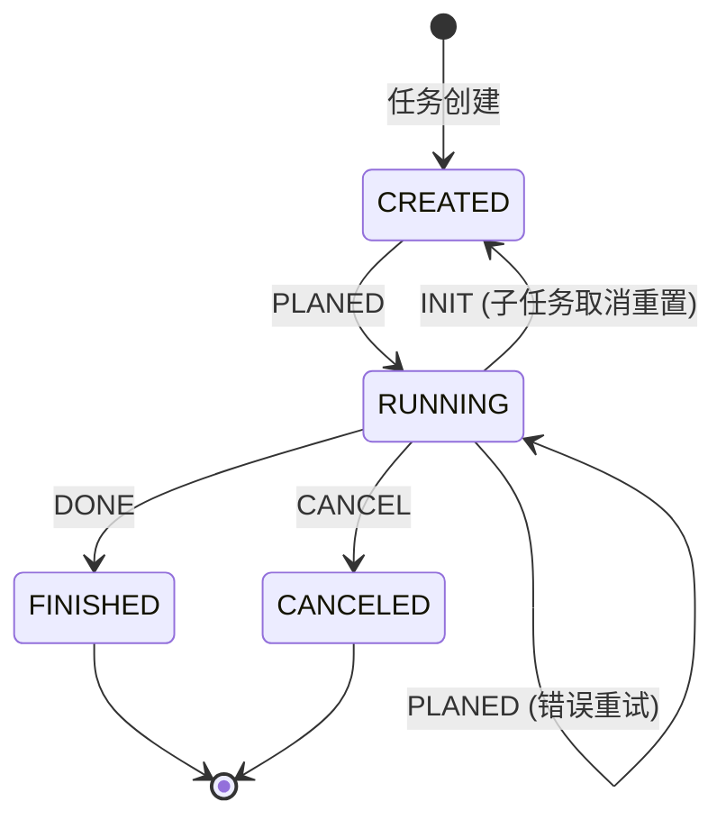
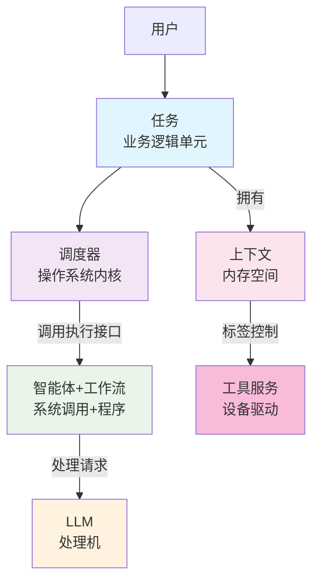
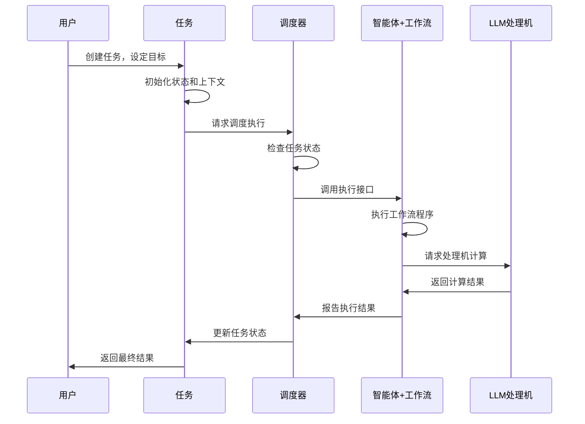

# Tasking - 任务驱动的智能体系统

## 任务驱动的智能体系统

**Tasking**是一个以任务为核心的智能体协作框架。我们的设计哲学是：**任务是一切执行和协作的基础**。

每个任务都是一个独立的管理单元，拥有自己的生命周期、上下文和执行需求。智能体通过执行任务来创造价值，而系统通过管理任务来实现复杂的协作模式。

### 核心创新：从上下文隔离到信息连接

传统AI框架的核心挑战是**如何通过各种手段避免上下文干扰**，它们将一切不一定存在关联的上下文按照时间线串联在一起，并通过各种手段降低其中的干扰。

**Tasking的全新思路**：我们专注于**如何建立任务信息的有效连接**。

#### 传统框架的困境
- **上下文窗口限制**：大量工具信息挤占宝贵的上下文空间
- **信息污染风险**：不同任务的状态和工具相互干扰
- **协作复杂性**：需要复杂的机制来维护隔离边界

#### Tasking的解决方案
- **任务作为连接单元**：每个任务天然是信息的载体和组织者
- **标签驱动的精准匹配**：工具按需加载，避免信息过载
- **层次化信息传递**：父子任务间通过标准接口传递必要信息

### 核心设计理念

**任务驱动的协作模式**：
- **任务自治**：每个任务独立管理自己的状态和输入输出
- **信息连接**：任务间通过层次化关系建立有效的信息传递
- **职责分离**：调度、执行、管理各司其职，边界清晰
- **协作扩展**：支持单个任务的独立执行和多任务的层次化协作

**智能体的无状态设计**：
智能体是纯粹的执行能力提供者，不维护任何任务状态。就像操作系统中的系统服务，它们通过标准接口响应任务调用，专注于高质量的执行结果。

---

## 上下文管理：从避免干扰到建立连接

### 设计范式的转变

**传统范式**：避免上下文干扰
- 将上下文管理视为防御性任务
- 通过隔离机制保护信息完整性
- 限制信息的流动和共享

**Tasking范式**：建立信息连接
- 将上下文管理视为协作机会
- 通过任务层次化实现信息有序传递
- 促进必要信息的有效流通

### 实现对比

#### 传统多智能体系统的隔离方式
- **Sub-agent隔离**：通过创建专门的sub-agents处理不同类型的问题
- **Skills约束**：通过skills系统限制sub-agents能访问的工具和信息
- **作用域分离**：每个sub-agent在自己的上下文空间内工作

#### Tasking的隔离方式
- **任务状态连接**：通过任务的状态机和层次化关系建立信息通道
- **标签系统匹配**：通过任务标签和工具标签的精准匹配实现按需加载
- **任务空间协作**：任务间通过标准接口进行必要的信息交换

### Tasking的优势

**信息效率**：
- 传统方式：所有工具信息预加载，造成上下文浪费
- Agent Skills: 预加载部分工具介绍，必要时再加载工具使用指南，需要多轮行动
- Tasking方式：任务类型限制了行动空间，按需加载工具，信息传递更精准

**协作能力**：
- 传统方式：严格隔离限制协作灵活性
- Tasking方式：层次化连接支持复杂协作

**可扩展性**：
- 传统方式：新增工具需要复杂的隔离规则
- Tasking方式：通过标签匹配自然扩展工具生态

### 核心价值：从防御到业务协作

Tasking的设计哲学体现了AI系统设计的演进：**从被动防御上下文干扰，到主动建立任务信息连接**。这种转变不仅解决了上下文管理问题，更重要的是开发者定义了AI协作的范式，使得开发者精进业务逻辑的同时AI也可以更好地协作完成复杂任务。

---

## 系统架构：任务驱动的执行模型

### 任务自治：独立的管理单元

每个Task都是系统中的基本执行和协作单元：



**任务的自治特性**：
- **状态独立管理**：任务自己管理完整的生命周期状态
- **上下文隔离**：每个任务维护独立的上下文空间
- **职责单一**：只关心自己的输入、执行和输出
- **协作友好**：支持层次化组织，但不关心子任务的具体执行

### 职责分离：清晰的边界设计

#### 任务的职责边界
**关心什么**：
- 自己的状态变化（CREATED → RUNNING → FINISHED/CANCELED）
- 自己的输入和输出
- 按照约定及时报告执行结果或错误

**不关心什么**：
- 自己会被哪个调度器调度
- 父任务如何分解和管理
- 子任务的具体执行过程
- 其他任务的存在和状态

#### 调度器的职责边界
**关心什么**：
- **只关心 Task 的状态机状态**
- 根据状态进行任务调度
- 在状态改变时执行后处理
- 任务间的协调和资源管理
- 系统的保护和错误恢复

**不关心什么**：
- 任务的具体执行内容和逻辑
- 任务使用什么工具和算法
- 任务如何推进
- 任务为什么要这样执行

#### 工作流/Agent的职责边界
**关心什么**：
- **不关心 Task 的状态**
- 只关心任务运行期间的推进情况
- Workflow：依推进情况驱动自身状态变化
- Agent：专注任务内容的正确执行和推进

**不关心什么**：
- Task 的状态管理
- 任务生命周期推进
- 状态转换逻辑
- 调度器的实现细节

#### 智能体+工作流的职责边界
**关心什么**：
- 任务如何被高质量地执行
- 如何利用LLM和其他工具完成任务
- 执行流程的规范化和优化

**不关心什么**：
- 任务从哪里来，要到哪里去
- 为什么需要执行这个任务
- 任务的调度和状态管理

### 与操作系统的类比



**系统组件类比**：
- **任务** = 业务逻辑单元（类似应用程序）
- **上下文** = 内存空间（存储任务的数据和状态）
- **调度器** = 操作系统内核（负责任务调度和系统保护）
- **智能体+工作流** = 系统调用+程序（提供标准化的执行接口和流程）
- **LLM** = 处理机（执行实际的计算和推理）
- **工具服务** = 设备驱动（提供特定的系统能力）

### 协作模式：职责驱动的交互



**关键洞察**：通过明确的职责分离，每个组件都能专注于自己的核心能力，同时通过标准化的接口实现高效的协作。这种设计既保证了系统的灵活性，又确保了各组件的可测试性和可维护性。

---

## 快速开始：构建你的第一个任务驱动智能体

### 第一步：理解信息连接的思维

在开始之前，让我们理解任务驱动的核心思维：

```
用户想要完成什么？ → 创建一个任务 → 系统内核调度 → 执行器处理 → 产出结果
```

### 第二步：环境准备

Tasking使用现代化的Python 3.12+环境：

```bash
# 克隆仓库
git clone <repository-url>
cd tasking

# 创建项目环境
uv sync

# 验证环境
uv run python --version
uv run python main.py
```

⚠️ **重要**：所有开发操作必须使用 uv 环境管理：

```bash
# ✅ 正确方式 - 使用 uv
uv run python main.py
uv run pytest tests/
uv run python -m pylint tasking/
uv run python -m pyright tasking/

# ❌ 错误方式 - 直接使用系统 Python
python3 main.py          # 禁止
pip install package      # 禁止
pytest tests/           # 禁止
```

复制配置文件模板，并修改内容

```bash
# 复制 .env 模板
cp .env.template .env

# 修改 .env 中的内容
# 为 executor_agent 定义基本信息
AGENTS__executor_agent__name=demo
AGENTS__executor_agent__agent_type=EXECUTOR
# 为该 agent 指定默认的 LLM（使用 agent 下的 llm 映射）
AGENTS__executor_agent__llm__default__provider=openai
AGENTS__executor_agent__llm__default__model=GLM-4.6
AGENTS__executor_agent__llm__default__base_url=https://open.bigmodel.cn/api/coding/paas/v4
AGENTS__executor_agent__llm__default__api_key=REPLACE_WITH_EXECUTOR_API_KEY
```

### 第三步：创建你的第一个任务

让我们构建一个完整的任务执行故事：

```python
import asyncio

from loguru import logger
from fastmcp import Client

from tasking.core.agent import build_simple_agent
from tasking.core.scheduler import build_base_scheduler
from tasking.core.state_machine.task import build_default_tree_node
from tasking.model import Message, IQueue, AsyncQueue

async def main():
    """执行一个完整的任务执行故事"""

    # 故事开始：用户有一个目标
    logger.info("🎯 用户目标：介绍人工智能技术")

    # 第一步：创建智能体执行器（Agent + Workflow）
    mcp = Client("./server.py")
    agent = build_simple_agent(name="AI助手", tool_service=mcp)
    logger.info("🤖 智能体执行器已创建，提供高质量执行能力")

    # 第二步：创建调度器（任务状态管理器）
    scheduler = create_simple_scheduler(agent)
    logger.info("📋 调度器已就绪，管理任务状态")

    # 第三步：创建任务单元
    task = build_default_tree_node()
    task.set_input("介绍一下人工智能技术")
    logger.info("📋 任务单元已创建，目标已设定")

    # 第四步：执行任务流程
    message_queue: IQueue[Message] = AsyncQueue()
    await scheduler.schedule({}, message_queue, task)

    # 第五步：获取任务结果
    result = task.get_output()
    logger.info(f"✅ 任务执行完成，结果：{result}")

    # 故事结束：从目标到结果的完整流程
    logger.info("🎊 任务驱动执行完成！")

if __name__ == "__main__":
    asyncio.run(main())
```

### 第四步：观察任务执行流程

当你运行上面的代码，你将看到完整的任务执行流程：

```
🎯 用户目标：介绍人工智能技术
🤖 智能体执行器已创建，提供高质量执行能力
📋 调度器已就绪，管理任务状态
📋 任务单元已创建，目标已设定
🔄 任务状态：CREATED → RUNNING → FINISHED
✅ 任务执行完成，结果：人工智能技术是...
🎊 任务驱动执行完成！
```

### 第五步：运行和验证

```bash
# 运行你的第一个任务进程
uv run python main.py

# 运行代码质量检查（确保系统稳定性）
uv run pyright tasking/
uv run pylint tasking/

# 运行测试套件（验证所有功能）
uv run pytest tests/ -v
```

---

## 系统架构优势

Tasking通过清晰的职责分离和标准化接口实现了以下关键优势：

### 关键设计优势

#### 1. 状态可观测性
- 每个任务进程都有明确的状态
- 完整的执行过程追踪
- 便于调试和监控

#### 2. 错误隔离性
- 单个进程失败不影响整个系统
- 进程间完全隔离
- 支持进程级别的错误恢复

#### 3. 扩展灵活性
- 组件职责清晰，易于扩展
- 支持不同的执行模式
- 可插拔的工具和服务

#### 4. 类型安全性
- 基于现代Python类型系统
- 编译时错误检查
- IDE友好的开发体验

---

## 适用场景：何时选择Tasking？

### 最适合使用Tasking的场景

1. **复杂任务协作**：需要多个任务层次化协作来完成复杂目标
2. **状态管理要求高**：需要精确追踪和控制任务执行状态
3. **团队协作开发**：需要清晰的接口和职责分离的项目
4. **长期维护系统**：需要稳定可靠的生产级AI系统
5. **自定义扩展需求**：需要集成特定工具和服务的场景

### Tasking的核心价值

- **清晰性**：明确的职责边界让系统易于理解和维护
- **可靠性**：完整的错误处理和状态管理确保系统稳定
- **扩展性**：标准化的接口设计支持灵活的功能扩展
- **协作性**：任务驱动的模式支持复杂的多人协作开发

---

## 开发者资源

### 📚 核心文档
- **[开发者文档](tasking/README.md)** - 完整的架构说明、API文档和最佳实践
- **[CLAUDE.md](CLAUDE.md)** - AI辅助开发规范和代码质量要求

### 🔧 核心能力 Road Map

**任务管理核心**：
- [x] 完整的任务状态机（CREATED → RUNNING → FINISHED/CANCELED）
- [x] 任务级上下文隔离和权限控制
- [x] 层次化任务组织（任务树结构）

**AI执行引擎**：
- [x] 智能体执行器（Agent）- 无状态的高质量执行
- [x] 任务调度器（Scheduler）- 基础调度和系统保护
- [ ] 工作流程序（Workflow）- 多种执行模式
  - [x] ReAct
  - [x] Orchestrate
  - [ ] Plan and Execute

**开发基础设施**：
- [x] 现代Python类型系统（Python 3.12+）
- [x] 完整的错误处理和恢复机制
- [x] 异步优先的执行框架
- [x] 提供商无关的LLM集成接口

---

### 🎯 MVP设计原则

Tasking严格遵循奥卡姆剃刀原则：
- **核心功能完整**：任务管理、状态管理、执行引擎
- **接口清晰稳定**：为扩展预留标准化的接口
- **类型安全保障**：编译时错误检查和IDE友好
- **生产就绪**：为构建生产级智能体系统提供坚实基础

**注意**：这是一个最小可行产品（MVP），专注于核心架构的完整性和可扩展性，为后续的功能扩展提供稳固基础。
