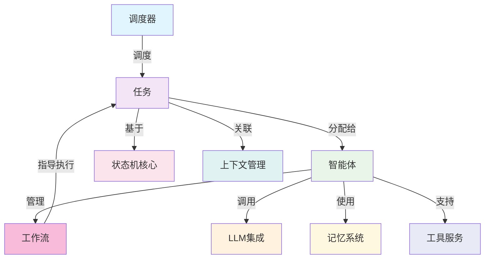

# Tasking - 任务驱动智能体系统

一个基于任务驱动的智能体系统服务端最小可行产品（MVP），提供构建AI智能体的基础框架，支持状态驱动的任务执行和大语言模型集成。

## 目录

- [Tasking - 任务驱动智能体系统](#tasking---任务驱动智能体系统)
  - [目录](#目录)
  - [项目概述](#项目概述)
    - [核心特性](#核心特性)
  - [系统架构](#系统架构)
    - [核心组件](#核心组件)
  - [快速开始](#快速开始)
    - [环境要求](#环境要求)
    - [环境配置](#环境配置)
    - [使用规范](#使用规范)
    - [基础使用](#基础使用)
  - [核心概念](#核心概念)
    - [任务驱动模式](#任务驱动模式)
    - [智能体类型](#智能体类型)
    - [上下文管理](#上下文管理)
  - [扩展性](#扩展性)
    - [当前MVP功能 ✅](#当前mvp功能-)
    - [未来扩展 🔧](#未来扩展-)
  - [相关文档](#相关文档)

## 项目概述

Tasking 是一个现代化的Python框架，专为构建复杂的人工智能智能体系统而设计。它提供了一个完整的状态机基础、任务编排系统和大语言模型集成层，让开发者能够快速构建可靠的AI智能体应用。

### 核心特性

- 🤖 **智能体框架**: 支持 SUPERVISOR、PLANNER、EXECUTOR 等多种智能体类型
- 📊 **状态驱动**: 完整的任务生命周期管理（INITED → CREATED → RUNNING → FINISHED/FAILED/CANCELED）
- 🌳 **层次化任务**: 支持树形任务结构，实现复杂工作流
- ⚡ **异步优先**: 全面的异步执行支持，适合高并发场景
- 🔗 **LLM集成**: 提供商无关的大语言模型集成接口
- 🛠 **类型安全**: 基于Python泛型的完整类型系统

## 系统架构



### 核心组件

1. **智能体系统** (`src/core/agent/`)
   - `IAgent`: 智能体接口，支持不同类型的AI智能体
   - 组合并管理工作流，指导任务执行模式
   - 执行分配的任务，是任务的最终执行者
   - LLM管理和流式响应配置
   - 任务执行与高效并发支持

2. **工作流引擎** (`src/core/state_machine/workflow/`)
   - `IWorkflow`: 工作流接口，定义Agent执行任务的阶段
   - 阶段转换和动作管理
   - 工具集成和观察模式
   - 支持ReAct等执行模式

3. **状态机核心** (`src/core/state_machine/task/`)
   - `BaseTask`: 基础任务实现，完整状态生命周期
   - `BaseTreeTaskNode`: 树形任务节点，支持层次化工作流
   - 支持任务状态转换和事件驱动

4. **调度系统** (`src/core/scheduler/`)
   - `BaseScheduler`: 基于状态的任务编排
   - 调度Task并分配给Agent执行
   - 循环检测与终止机制
   - 异步任务协调

5. **LLM集成层** (`src/llm/`, `src/model/`)
   - `ILLM`: 提供商无关的LLM接口
   - 消息系统与工具调用支持
   - 配置模型（完成式与流式）

6. **上下文管理系统** (`src/core/context/`)
   - `IContextual`: 上下文管理接口
   - 状态特定数据存储和检索
   - 临时笔记系统和格式化钩子

## 快速开始

### 环境要求

- Python 3.12+
- uv (推荐的Python包管理器)

### 环境配置

**第一步：安装 uv**

```bash
# macOS 和 Linux
curl -LsSf https://astral.sh/uv/install.sh | sh

# Windows (PowerShell)
powershell -c "irm https://astral.sh/uv/install.ps1 | iex"

# 或通过 pip 安装
pip install uv
```

**第二步：项目环境初始化**

```bash
# 克隆仓库
git clone <repository-url>
cd tasking-community

# 初始化 uv 虚拟环境（自动创建 .venv 目录）
uv venv

# 激活虚拟环境（可选，uv 会自动检测）
# Linux/macOS:
source .venv/bin/activate
# Windows:
.venv\Scripts\activate

# 安装项目依赖
uv pip install -e .

# 安装开发依赖（可选，用于测试和代码质量检查）
uv pip install -e ".[dev]"
```

**第三步：验证环境**

```bash
# 检查 Python 版本
uv run python --version

# 运行主程序验证
uv run python main.py

# 运行测试（可选）
uv run pytest tests/
```

### 使用规范

⚠️ **重要**：所有开发操作必须使用 uv 环境管理：

```bash
# ✅ 正确方式 - 使用 uv
uv run python main.py
uv run pytest tests/
uv run python -m pylint src/
uv run python -m pyright src/

# ❌ 错误方式 - 直接使用系统 Python
python3 main.py          # 禁止
pip install package      # 禁止
pytest tests/           # 禁止
```

### 基础使用

```python
import asyncio

from loguru import logger

from src.core.agent import build_simple_agent
from src.core.scheduler import create_simple_scheduler
from src.core.state_machine.task import build_default_tree_node
from src.model import Message, IQueue
from server.utils.queue import AQueue


async def run() -> None:
    """入口函数，演示任务状态机与简单Agent的集成使用"""

    # 创建简单Agent
    agent = build_simple_agent(name="demo")
    logger.info("Simple Agent created.")

    # 创建默认的简单调度器
    scheduler = create_simple_scheduler(agent)
    logger.info("Simple scheduler created.")

    # 创建默认的树形任务节点状态机实例
    task_node = build_default_tree_node()
    logger.info(f"Created task node with type: {task_node.get_task_type()}")

    # 用户输入任务目标
    task_node.set_input("介绍一下人工智能技术")

    # 创建消息队列
    message_queue: IQueue[Message] = AQueue()

    # 启动调度器
    await scheduler.schedule(dict[str, str](), message_queue, task_node)

    # 获取任务的输出结果
    output = task_node.get_output()
    logger.info(f"Task Output: {output}")


if __name__ == "__main__":
    asyncio.run(run())
```

**运行示例**：

```bash
# 使用 uv 运行基础示例
uv run python main.py

# 运行代码质量检查（开发时必需）
uv run pyright src/
uv run pylint src/

# 运行测试套件
uv run pytest tests/ -v
```

## 核心概念

### 任务驱动模式

系统采用任务驱动的执行模式：

1. **智能体执行任务**: 智能体通过LLM执行具体任务
2. **状态驱动流转**: 任务状态变化驱动执行流程
3. **层次化编排**: 支持复杂任务的树形分解

### 智能体类型

- **SUPERVISOR**: 监督型智能体，负责任务分解和监控
- **PLANNER**: 规划型智能体，负责任务规划和路径设计
- **EXECUTOR**: 执行型智能体，负责具体任务执行

### 上下文管理

每个状态都维护独立的上下文信息，支持：
- 状态特定数据存储
- 临时笔记系统
- 自定义格式化钩子

## 扩展性

### 当前MVP功能 ✅
- 核心状态机框架
- 智能体接口定义
- LLM集成框架
- 层次化任务管理
- 任务调度系统
- 上下文管理
- 错误处理与恢复
- 完整类型系统

### 未来扩展 🔧
- 具体LLM提供商实现（OpenAI、Anthropic、本地模型）
- 网络服务层（HTTP/gRPC接口）
- 监控与追踪
- 安全认证
- 工具集成框架
- 多智能体协调

## 相关文档

- 📚 **[开发者文档](src/README.md)** - 详细的开发者指南，包含完整的架构说明、API文档和最佳实践
- 🤖 **[CLAUDE.md](CLAUDE.md)** - AI辅助开发规范，包含项目开发约定、环境配置和代码质量要求

---

**注意**: 这是一个最小可行产品（MVP），遵循奥卡姆剃刀原则设计。核心功能完整且可扩展，为构建生产级智能体系统提供了坚实基础。
