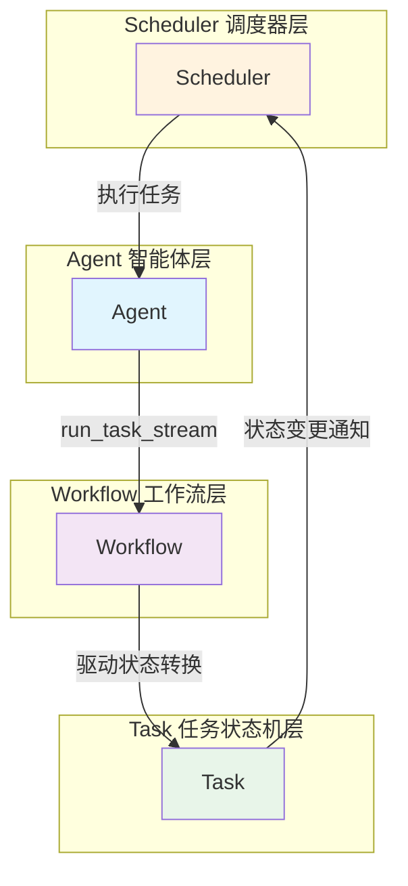
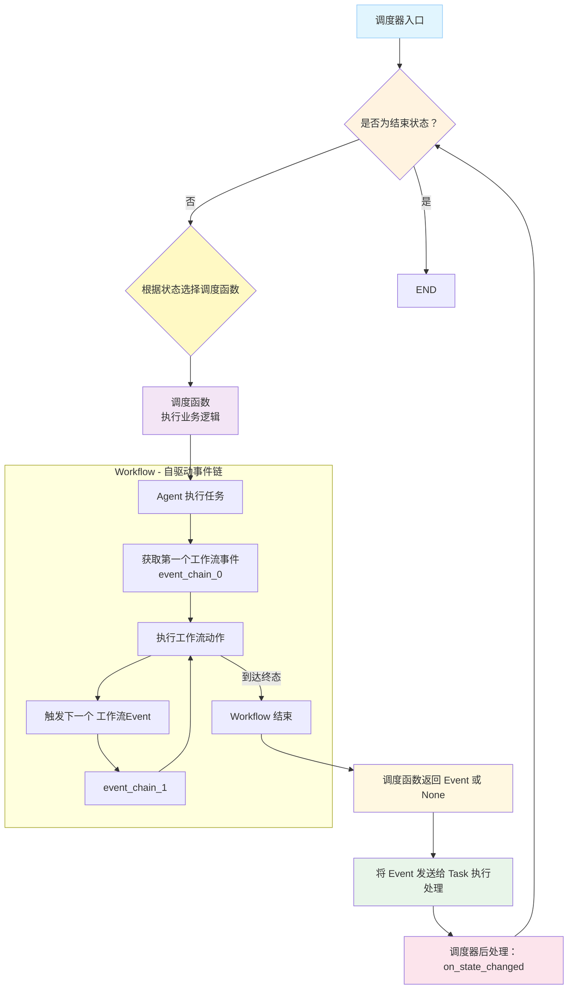
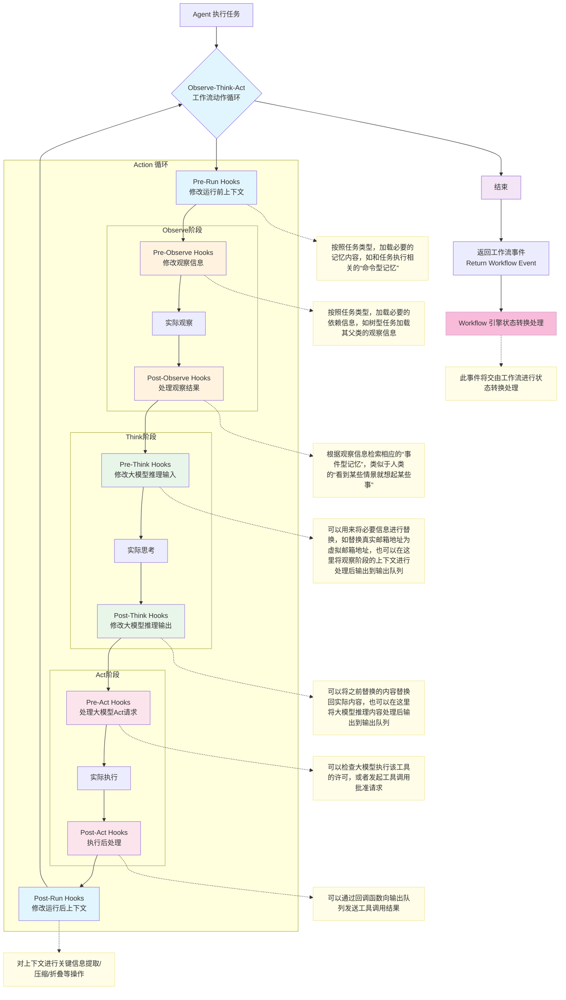
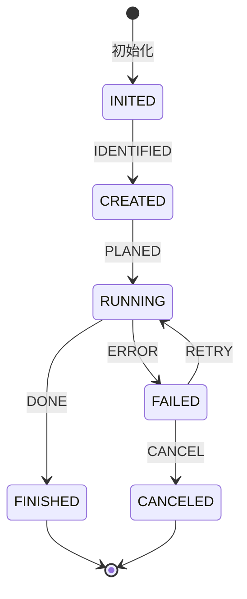
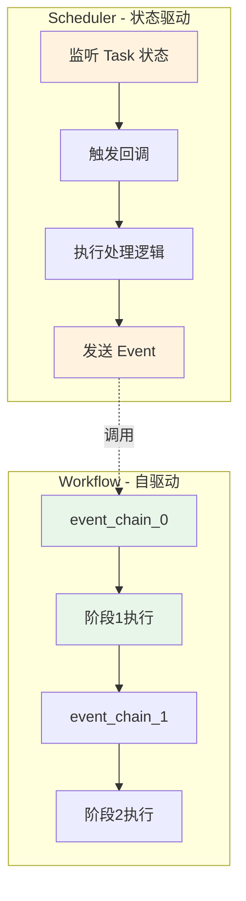

# Tasking 开发者指南

> 本文档面向希望使用或扩展 Tasking 框架的开发者，详细介绍核心模块的设计原理、API 使用和最佳实践。

## 目录

- [系统架构概览](#系统架构概览)
- [项目结构](#项目结构)
- [快速开始](#快速开始)
- [核心模块简介](#核心模块简介)
- [开发实践](#开发实践)
- [详细文档](#详细文档)

---

## 系统架构概览

Tasking 是一个基于状态机的任务驱动智能体框架，核心架构采用 **Agent ↔ Workflow ↔ Task ↔ Scheduler** 协作模式：



## 项目结构

```plaintext
src/
├── core/                # 核心框架模块
│   ├── agent/           # 智能体框架
│   │   ├── interface.py # IAgent接口
│   │   ├── const.py     # 智能体类型定义
│   │   ├── react.py     # React模式智能体实现
│   │   ├── simple.py    # 简单智能体实现
│   │   ├── orchestrate.py # 编排模式智能体
│   │   └── plan_and_exec.py # 计划执行模式智能体
│   ├── context/         # 上下文管理系统
│   │   ├── interface.py # IContextual接口
│   │   └── base.py      # 上下文基础实现
│   ├── middleware/      # 中间件系统
│   │   └── step_counter.py # 步数计数中间件
│   ├── scheduler/       # 任务调度系统
│   │   ├── interface.py # IScheduler接口
│   │   ├── base.py      # 基础调度器
│   │   ├── simple.py    # 简单调度器实现
│   │   └── tree.py      # 树形调度器实现
│   └── state_machine/   # 状态机核心
│       ├── interface.py # 状态机接口
│       ├── base.py      # 基础实现
│       ├── const.py     # 状态和事件枚举
│       ├── task/        # 任务子模块
│       │   ├── interface.py
│       │   ├── base.py
│       │   ├── tree.py
│       │   ├── tree_node_builder.py
│       │   └── const.py
│       └── workflow/    # 工作流子模块
│           ├── interface.py
│           ├── base.py
│           └── const.py
├── database/            # 数据库模块
├── llm/                # 大语言模型集成
│   ├── interface.py     # ILLM接口
│   ├── openai.py        # OpenAI实现
│   └── const.py         # LLM提供商类型
├── memory/             # 内存管理系统
│   ├── interface.py     # 内存接口
│   ├── tree.py          # 树形内存实现
│   └── const.py         # 内存常量
├── model/              # 数据模型
│   ├── message.py       # 消息和角色定义
│   ├── llm.py          # LLM配置类
│   └── setting.py      # 设置模型
└── utils/              # 工具模块
    ├── io.py           # IO工具
    ├── string/         # 字符串工具
    │   └── extract.py
    └── transform/      # 转换工具
        └── tool.py
```

---

## 核心流程

1. 调度器 schedule 流程


2. 工作流 Action 循环


---

## 核心模块简介

### Task 模块

**任务生命周期管理**
- 基于状态机的任务生命周期：INITED → CREATED → RUNNING → FINISHED/FAILED/CANCELED
- 支持树形层次结构，任务可分解为子任务
- 每个状态维护独立的上下文数据



**创建任务示例**
```python
from src.core.state_machine.task import build_base_tree_node
from src.model.llm import CompletionConfig

# 创建基础任务
task = build_base_tree_node(
    protocol="example_v1.0",
    tags={"example"},
    task_type="demo_task",
    max_depth=3,
)

# 设置输入输出
task.set_input({"data": "example_data"})
task.set_completed(output='{"result": "success"}')
```

### Workflow 模块

**阶段化执行流程**（自驱动）
- 支持 ReAct（Reason-Act-Reflect）等执行模式
- 根据 event_chain 自主推进，不关心 Task 状态
- 每个阶段配置动作函数和提示模板
- Workflow 是必须能达到终点的有限状态机

### Scheduler 模块

**任务调度编排**（状态驱动）
- 监听 Task 状态变化并触发回调
- 根据 Task 状态进行调度和后续处理
- 通过发送 Event 驱动 Task 状态转换
- Task 是必须能达到终点的有限状态机

### Scheduler vs Workflow 的关键区别

| 特性 | Scheduler | Workflow |
|------|-----------|----------|
| **驱动方式** | 状态驱动（监听 Task 状态） | 事件驱动（按 event_chain） |
| **关注点** | Task 的生命周期管理 | 阶段化执行流程 |
| **状态转换** | 发送 Event 给 Task | 自主进行阶段转换 |
| **依赖关系** | 可调度 Workflow（通过 Agent 的 `run_task_stream` 接口） | 被 Scheduler 调用 |



### Agent Hooks 机制

**扩展点钩子**
- 预置和后置钩子覆盖整个执行流程
- 支持日志记录、性能监控、错误处理等
- 按注册顺序执行，支持同步/异步

---

#### 职责划分
- 工作流（Workflow）本身“不感知任务状态”。Workflow 的职责是按动作序列运行并产生“工作流事件”（workflow events），驱动工作流内部的自驱动流转与动作输出。为保证执行语义一致，所有 Workflow 的 action 应通过 Agent 的 observe/think/act 接口唤起对应阶段行为并返回工作流事件；若无法构成完整动作循环，请使用 Agent hooks 进行拦截或补充。
- 调度器的 ***调度函数*** 必须返回用于驱动任务状态变化的“任务事件”（task events）。调度器负责将该任务事件交给 Task（task.handle_event），并在 Task 状态变化后执行调度器的后处理逻辑（on_state_changed）。

> 简言之：Workflow 产生 workflow events；Scheduler 产生并消费 task events；只有 Scheduler 感知并控制 Task 的状态流转。


### 开发规范

- 修改 Agent 的 Hook（Agent hooks）
  - 可在 Agent 层加入拦截/预处理/后处理逻辑（如日志、缓存、流式响应控制等），影响任务执行上下文或消息流。

- 自定义 Workflow 的 action（Workflow Actions）
  - 每个 Workflow 的 action 都应通过 Agent 的 observe/think/act 调用来组成一个完整的 action，从而产生用于驱动工作流自身变化的工作流事件（workflow events）。若某个操作并非完整的 O/T/A 动作组合，则应考虑实现为 Agent 的 Hook（pre/post）而非定义新的 workflow 状态以及对应的 action。
  - 修改或新增工作流状态（如Execute/Reflect）来改变工作流行为。每个状态应维护对应的提示词以及 action 函数，每个 action 应返回工作流事件以驱动工作流内的进一步流转。

- 定制调度器行为（Scheduler）
  - 通过实现/替换调度函数（on_state_fn）来自定义当 Task 处于某状态时的业务执行逻辑（必须返回 task event 或 None）。
  - 通过实现状态变更后处理函数（on_state_changed_fn）来自定义在 Task 状态变更后需要执行的后处理逻辑（注意：后处理不会再次触发 on_state_changed 的循环）。

---

## 详细文档

各模块的详细说明请参考：

- **[状态机模块详解](./core/state_machine/README.md)** - Task、Workflow、状态机的详细使用
- **[Agent 模块](./core/agent/README.md)** - Agent 和 Hooks 机制（ReAct 功能开发中[WIP]）
- **[Scheduler 模块](./core/scheduler/README.md)** - 任务调度和编排（ReAct 功能开发中[WIP]）

**注意事项**：

1. 使用 `uv` 管理环境和依赖
2. 所有代码必须通过 pyright 和 pylint 检查
3. 测试覆盖率需达到 80%

---

**最后更新**: 2025-11-11
