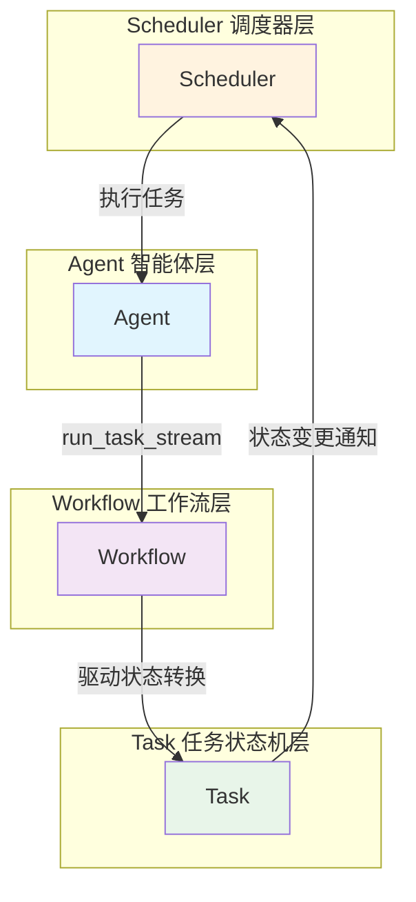
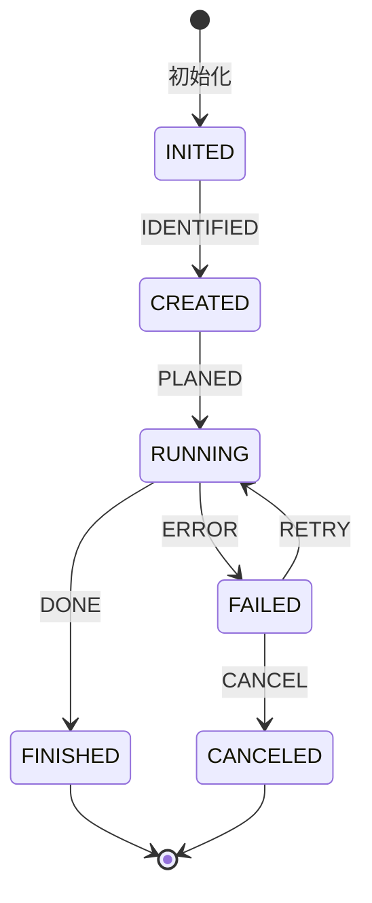
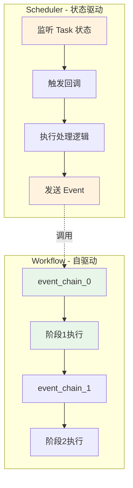

# Tasking 开发者指南

> 本文档面向希望使用或扩展 Tasking 框架的开发者，详细介绍核心模块的设计原理、API 使用和最佳实践。

## 目录

- [系统架构概览](#系统架构概览)
- [项目结构](#项目结构)
- [快速开始](#快速开始)
- [核心模块简介](#核心模块简介)
- [开发实践](#开发实践)
- [详细文档](#详细文档)

---

## 系统架构概览

Tasking 是一个基于状态机的任务驱动智能体框架，核心架构采用 **Agent ↔ Workflow ↔ Task ↔ Scheduler** 协作模式：



## 项目结构

```plaintext
src/
├── core/                # 核心框架模块
│   ├── agent/           # 智能体框架
│   │   ├── interface.py # IAgent接口
│   │   ├── const.py     # 智能体类型定义
│   │   ├── react.py     # React模式智能体实现
│   │   ├── simple.py    # 简单智能体实现
│   │   ├── orchestrate.py # 编排模式智能体
│   │   └── plan_and_exec.py # 计划执行模式智能体
│   ├── context/         # 上下文管理系统
│   │   ├── interface.py # IContextual接口
│   │   └── base.py      # 上下文基础实现
│   ├── middleware/      # 中间件系统
│   │   └── step_counter.py # 步数计数中间件
│   ├── scheduler/       # 任务调度系统
│   │   ├── interface.py # IScheduler接口
│   │   ├── base.py      # 基础调度器
│   │   ├── simple.py    # 简单调度器实现
│   │   └── tree.py      # 树形调度器实现
│   └── state_machine/   # 状态机核心
│       ├── interface.py # 状态机接口
│       ├── base.py      # 基础实现
│       ├── const.py     # 状态和事件枚举
│       ├── task/        # 任务子模块
│       │   ├── interface.py
│       │   ├── base.py
│       │   ├── tree.py
│       │   ├── tree_node_builder.py
│       │   └── const.py
│       └── workflow/    # 工作流子模块
│           ├── interface.py
│           ├── base.py
│           └── const.py
├── database/            # 数据库模块
├── llm/                # 大语言模型集成
│   ├── interface.py     # ILLM接口
│   ├── openai.py        # OpenAI实现
│   └── const.py         # LLM提供商类型
├── memory/             # 内存管理系统
│   ├── interface.py     # 内存接口
│   ├── tree.py          # 树形内存实现
│   └── const.py         # 内存常量
├── model/              # 数据模型
│   ├── message.py       # 消息和角色定义
│   ├── llm.py          # LLM配置类
│   └── setting.py      # 设置模型
└── utils/              # 工具模块
    ├── io.py           # IO工具
    ├── string/         # 字符串工具
    │   └── extract.py
    └── transform/      # 转换工具
        └── tool.py
```

---

## 快速开始

### 环境配置

```bash
# 安装 uv（如果未安装）
pip install uv

# 安装项目依赖
uv sync
```

### 开发与测试入口命令

```bash
# 运行测试
uv run pytest tests/ -v --cov=src --cov-report=term-missing

# 运行特定模块测试
uv run pytest tests/state_machine/ -v
uv run pytest tests/scheduler/ -v

# 类型检查
uv run mypy src/

# 运行示例
uv run python main.py
```

项目包含完整的测试套件：

- **状态机测试**: `tests/state_machine/` - 核心状态机功能测试
- **调度器测试**: `tests/scheduler/` - 任务调度系统测试

#### 运行测试

```bash
# 运行所有测试
uv run pytest tests/ -v

# 生成覆盖率报告
uv run pytest tests/ --cov=src --cov-report=html

# 查看覆盖率报告
open htmlcov/index.html  # macOS
# 或用浏览器打开 htmlcov/index.html
```

### 基础示例

```python
import asyncio
from queue import Queue

from src.core.state_machine.task import build_base_tree_node
from src.core.agent.simple import BaseAgent
from src.core.scheduler.simple import create_simple_scheduler
from src.model.llm import CompletionConfig

async def main():
    # 1. 创建任务
    task = build_base_tree_node(
        protocol="任务输入应该按照xxx的格式，任务输出应该按照xxx的格式进行",
        tags={"example"},
        task_type="demo_task",
        max_depth=3,
        completion_config=CompletionConfig(),
    )

    # 2. 创建 Agent（示例，需要配置实际 LLM）
    executor = BaseAgent(name="executor", agent_type="EXECUTOR", llms={...})

    # 3. 创建调度器
    scheduler = create_simple_scheduler(executor=executor)

    # 4. 执行任务
    context = {"user_id": "demo"}
    queue = Queue[Message]()
    await scheduler.schedule(context, queue, task)

if __name__ == "__main__":
    asyncio.run(main())
```

### 核心设计原则

1. **接口驱动**：所有核心组件都定义了清晰的接口契约
2. **异步优先**：支持高并发场景的异步执行
3. **类型安全**：基于 Python 3.12+ 泛型的完整类型系统
4. **可组合性**：支持模块化扩展和组合

---

## 核心模块简介

### Task 模块

**任务生命周期管理**
- 基于状态机的任务生命周期：INITED → CREATED → RUNNING → FINISHED/FAILED/CANCELED
- 支持树形层次结构，任务可分解为子任务
- 每个状态维护独立的上下文数据



**创建任务示例**
```python
from src.core.state_machine.task import build_base_tree_node
from src.model.llm import CompletionConfig

# 创建基础任务
task = build_base_tree_node(
    protocol="example_v1.0",
    tags={"example"},
    task_type="demo_task",
    max_depth=3,
    completion_config=CompletionConfig(),
)

# 编译状态机
task.compile(max_revisit_count=3)

# 设置输入输出
task.set_input({"data": "example_data"})
task.set_completed(output='{"result": "success"}')
```

### Workflow 模块

**阶段化执行流程**（自驱动）
- 支持 ReAct（Reason-Act-Reflect）等执行模式
- 根据 event_chain 自主推进，不关心 Task 状态
- 每个阶段配置动作函数和提示模板
- Workflow 是必须能达到终点的有限状态机

### Scheduler 模块

**任务调度编排**（状态驱动）
- 监听 Task 状态变化并触发回调
- 根据 Task 状态进行调度和后续处理
- 通过发送 Event 驱动 Task 状态转换
- Task 是必须能达到终点的有限状态机

### Scheduler vs Workflow 的关键区别

| 特性 | Scheduler | Workflow |
|------|-----------|----------|
| **驱动方式** | 状态驱动（监听 Task 状态） | 事件驱动（按 event_chain） |
| **关注点** | Task 的生命周期管理 | 阶段化执行流程 |
| **状态转换** | 发送 Event 给 Task | 自主进行阶段转换 |
| **依赖关系** | 可调度 Workflow（通过 Agent 的 `run_task_stream` 接口） | 被 Scheduler 调用 |



### Agent Hooks 机制

**扩展点钩子**
- 预置和后置钩子覆盖整个执行流程
- 支持日志记录、性能监控、错误处理等
- 按注册顺序执行，支持同步/异步

---

## 开发实践

项目结构

```plaintext
my_project/
├── agents/             # Agent 自定义实现
├── tasks/              # 自定义 Task
├── schedulers/         # Scheduler 配置
├── prompts/            # Prompts 文件与读取工具
│   ├── read_prompt.py  # 单次运行前 hooks
│   ├── task/           # 任务执行的协议提示词
│   └── workflow/       # 工作流提示词
└── hooks/              # Hooks 实现
    ├── pre_once/       # 单次运行前 hooks
    ├── post_once/      # 单次运行后 hooks
    ├── pre_observe/    # 观察前 hooks
    ├── post_observe/   # 观察后 hooks
    ├── pre_think/      # 思考前 hooks
    ├── post_think/     # 思考后 hooks
    ├── pre_act/        # 执行前 hooks
    └── post_act/       # 执行后 hooks
```

---

## 详细文档

各模块的详细说明请参考：

- **[状态机模块详解](./core/state_machine/README.md)** - Task、Workflow、状态机的详细使用
- **[Agent 模块](./core/agent/README.md)** - Agent 和 Hooks 机制（ReAct 功能开发中[WIP]）
- **[Scheduler 模块](./core/scheduler/README.md)** - 任务调度和编排（ReAct 功能开发中[WIP]）

**注意事项**：

1. 使用 `uv` 管理环境和依赖
2. 所有代码必须通过 pyright 和 pylint 检查
3. 测试覆盖率需达到 80%

---

**最后更新**: 2025-11-11
