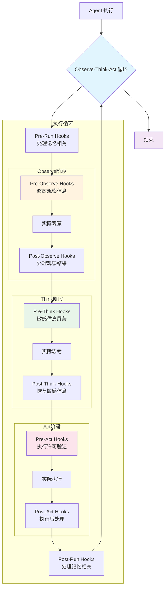

# Agent 模块文档

> Agent 模块提供智能体实现，支持 LLM 集成、工作流管理和扩展钩子机制。
>
> **注意**: ReAct 工作流相关功能正在开发中 [WIP]

## 核心功能

### Agent 类型

Agent 支持三种类型：

- **SUPERVISOR**: 监督型智能体，负责任务分解和子任务协调
- **PLANNER**: 规划型智能体，负责任务规划和执行计划制定
- **EXECUTOR**: 执行型智能体，负责具体任务执行

### 创建 Agent

```python
from src.core.agent.simple import BaseAgent
# 注意：ReAct 相关功能正在开发中 [WIP]

# 创建基础 Agent
# agent = BaseAgent[name="my_agent", agent_type="EXECUTOR", llms={}, tool_service=None]

# 关联工作流 [WIP]
# agent.set_workflow(workflow)
```

### 执行任务

```python
from queue import Queue

# 执行任务流式返回 [WIP]
# context = {"user_id": "user123", "session_id": "abc"}
# queue = Queue[Message]()
#
# result_task = await agent.run_task_stream(
#     context=context,
#     queue=queue,
#     task=task
# )
```

## Hooks 机制

Hooks 是 Agent 的扩展机制，允许在每次执行的各个关键节点注入自定义逻辑：



### Run Hooks - 记忆管理

**在每次循环前后触发**，主要用于处理 Agent 的记忆相关操作。

```python
# 每次循环前
# 示例函数 - 需要根据实际需求实现
async def pre_run_hook(
    context: dict[str, Any],
    queue: Queue[Message],
    task: ITask[TaskState, TaskEvent]
) -> None:
    """每次循环前的记忆准备"""
    # 从长期记忆加载相关信息
    # context["working_memory"] = load_working_memory(task.get_id())  # 示例函数

    # 设置本次循环的上下文
    context["loop_count"] = context.get("loop_count", 0) + 1
    print(f"[Loop {context['loop_count']}] 开始新一轮执行")

# 每次循环后
async def post_run_hook(
    context: dict[str, Any],
    queue: Queue[Message],
    task: ITask[TaskState, TaskEvent]
) -> None:
    """每次循环后的记忆整理"""
    # 保存工作记忆到长期存储
    # working_memory = context.get("working_memory", {})
    # save_working_memory(task.get_id(), working_memory)  # 示例函数

    # 压缩和整理记忆
    if context.get("loop_count", 0) % 5 == 0:  # 每5轮压缩一次
        # compress_memories(task.get_id())  # 示例函数
        pass

# 注册 Hooks
agent.add_pre_run_once_hook(pre_run_hook)
agent.add_post_run_once_hook(post_run_hook)
```

### Observe Hooks - 观察信息处理

**用于处理对观察信息的修改操作**。

```python
# 观察前，修改观察行为
# 示例函数 - 需要根据实际需求实现
async def pre_observe_hook(
    context: dict[str, Any],
    queue: Queue[Message],
    task: ITask[TaskState, TaskEvent]
) -> None:
    """修改观察行为或过滤观察源"""
    # 根据用户权限设置观察范围
    user_role = context.get("user_role", "guest")
    if user_role == "guest":
        # 访客只能看到部分信息
        context["observe_scope"] = "public"
    else:
        context["observe_scope"] = "all"

# 观察后，修改观察结果
async def post_observe_hook(
    context: dict[str, Any],
    queue: Queue[Message],
    task: ITask[TaskState, TaskEvent],
    observe_res: list[Message]
) -> None:
    """处理和修改观察结果"""
    # 清理观察结果，移除敏感信息
    cleaned_results = []
    for msg in observe_res:
        # cleaned_msg = filter_sensitive_info(msg)  # 示例函数，需要实现
        cleaned_results.append(msg)

    # 更新观察结果（列表是可变的）
    observe_res.clear()
    observe_res.extend(cleaned_results)

    # 添加元数据注释
    for msg in observe_res:
        msg.metadata = {"source": "filtered", "timestamp": time.time()}

# agent.add_pre_observe_hook(pre_observe_hook)
# agent.add_post_observe_hook(post_observe_hook)
```

### Think Hooks - 敏感信息处理

**用于敏感信息的屏蔽和恢复操作**。

```python
# 示例函数 - 需要根据实际需求实现
async def pre_think_hook(
    context: dict[str, Any],
    queue: Queue[Message],
    observe_res: list[Message]
) -> None:
    """屏蔽观察结果中的敏感信息"""
    # 保存原始信息到上下文，以便恢复
    # context["original_observe"] = copy.deepcopy(observe_res)  # 需要 import copy

    # 屏蔽敏感信息
    for msg in observe_res:
        if msg.content:
            # 替换个人信息
            # msg.content = mask_personal_info(msg.content)  # 示例函数
            # 替换机密数据
            # msg.content = mask_confidential_data(msg.content)  # 示例函数
            # 标记已屏蔽
            msg.metadata = msg.metadata or {}
            msg.metadata["masked"] = True

# 思考后，恢复敏感信息（如果需要）
async def post_think_hook(
    context: dict[str, Any],
    queue: Queue[Message],
    observe_res: list[Message],
    think_result: Message
) -> None:
    """处理思考结果，必要时恢复信息"""
    # 清理思考结果中的敏感信息
    if think_result.content:
        # think_result.content = sanitize_thinking_output(think_result.content)  # 示例函数
        pass

    # 如果需要保留原始观察用于后续处理
    if context.get("keep_original"):
        # 恢复观察信息
        # original = context.get("original_observe", [])
        # observe_res.clear()
        # observe_res.extend(original)
        pass

# agent.add_pre_think_hook(pre_think_hook)
# agent.add_post_think_hook(post_think_hook)
```

### Act Hooks - 执行许可与安全

**用于敏感信息处理和执行许可验证**。

```python
# 行动前，执行许可验证
async def pre_act_hook(
    context: dict[str, Any],
    queue: Queue[Message],
    task: ITask[TaskState, TaskEvent]
) -> None:
    """验证执行许可和安全检查"""
    # 检查用户权限
    user_id = context.get("user_id")
    action_permission = check_user_permission(user_id, "execute_tools")

    if not action_permission:
        raise PermissionError(f"用户 {user_id} 无执行工具权限")

    # 检查工具使用频率限制
    tool_name = context.get("pending_tool")
    if not check_rate_limit(user_id, tool_name):
        raise RateLimitError(f"工具 {tool_name} 使用频率超限")

    # 记录执行审计日志
    log_action_attempt(user_id, tool_name, task.get_id())

# 行动后，处理敏感结果
async def post_act_hook(
    context: dict[str, Any],
    queue: Queue[Message],
    task: ITask[TaskState, TaskEvent],
    act_result: Message
) -> None:
    """处理执行结果和敏感信息"""
    # 检查执行结果是否包含敏感信息
    if act_result.content:
        # 脱敏处理
        act_result.content = desensitize_result(act_result.content)

        # 添加水印（如需要）
        if context.get("add_watermark"):
            act_result.content = add_watermark(
                act_result.content,
                user_id=context.get("user_id")
            )

    # 更新使用统计
    update_usage_stats(context.get("user_id"), context.get("tool_name"))

    # 记录执行日志
    log_action_complete(
        user_id=context.get("user_id"),
        tool_name=context.get("tool_name"),
        success=act_result.metadata.get("success", True)
    )

agent.add_pre_act_hook(pre_act_hook)
agent.add_post_act_hook(post_act_hook)
```

## 核心能力

### Observe - 观察

从任务和环境中提取信息：

```python
observations = await agent.observe(
    context={},
    queue=queue,
    task=task
)
```

### Think - 思考

基于观察进行推理：

```python
from src.model.llm import CompletionConfig

think_result = await agent.think(
    context={},
    queue=queue,
    llm_name="reasoning",
    observe=observations,
    completion_config=CompletionConfig(
        model="gpt-4",
        max_tokens=1000,
        temperature=0.7
    )
)
```

### Act - 行动

执行工具调用：

```python
act_result = await agent.act(
    context={},
    queue=queue,
    task=task,
    think_result=think_result
)
```

## 工具调用

Agent 支持通过工作流调用工具：

```python
# 通过工作流调用工具
result = await workflow.call_tool(
    name="search",
    task=task,
    inject={"user_id": context.get("user_id")},
    kwargs={"query": "Python async", "max_results": 5}
)

# 直接通过 Agent 调用工具
result = await agent.call_tool(
    name="search",
    task=task,
    inject={},
    kwargs={}
)
```

## 最佳实践

1. **Hooks 执行顺序**：同类型 Hooks 按注册顺序执行
2. **错误处理**：在 Hooks 中捕获异常，避免影响主流程
3. **性能监控**：使用 Hooks 记录执行时间和性能指标
4. **权限控制**：在 Pre-Act Hooks 中检查工具调用权限
5. **日志记录**：使用 Hooks 记录详细的执行日志

**最后更新**: 2025-11-11