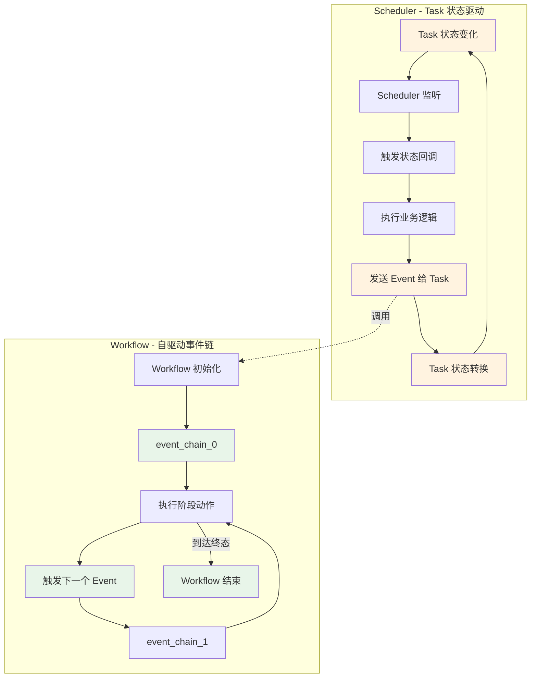
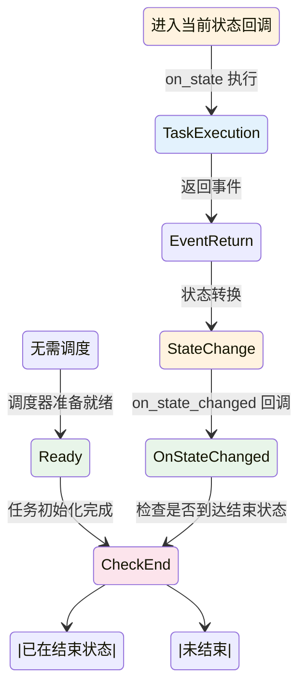

# Scheduler 模块文档

> Scheduler 模块负责任务调度和编排，监听任务状态变化并触发相应的业务逻辑。

## 核心概念

Scheduler 是一个**灵活的调度系统**，具有以下特点：

- **状态驱动**：默认监听 Task 的状态变化，根据状态触发相应的处理逻辑
- **Task 状态管理**：Scheduler 负责推进 Task 的生命周期，从 INITED 到最终状态
- **事件分发**：Scheduler 通过发送 Event 给 Task 来驱动状态转换
- **灵活调度**：可以根据任务的**状态/标签/类别/协议**等属性进行自定义调度
- **有限状态机**：Task 是一个必须能达到终点的图数据结构，Scheduler 确保状态可达性

## Scheduler vs Workflow 的区别



**关键区别**：
- **Scheduler**：关心 Task 的状态，根据 Task 状态变化进行调度和后续处理
- **Workflow**：不关心 Task 状态，按照自己的 event_chain 自主执行各个阶段

## 核心功能

### 调度器类型

#### create_simple_scheduler

单层任务调度器，适合简单的任务执行场景：

```python
from src.core.scheduler.simple import create_simple_scheduler
from src.core.agent.simple import BaseAgent
# 注意：ReAct 相关功能正在开发中 [WIP]

# 定义一个快捷的函数用于读取你的提示词
from your.read.util import read_prompt

# 需要先配置 executor Agent
executor = BaseAgent[name="executor", agent_type="EXECUTOR", llms={}]  # 配置 LLM

# 创建简单调度器
scheduler = create_simple_scheduler(
    executor=executor,
    max_error_retry=3
)
```

#### create_tree_scheduler

支持树形任务的递归调度，适合复杂工作流：

```python
from src.core.scheduler.tree import create_tree_scheduler
# 注意：ReAct 相关功能正在开发中 [WIP]

# 定义一个快捷的函数用于读取你的提示词
from your.read.util import read_prompt

# 需要配置不同角色的 Agent
supervisor = BaseAgent[name="supervisor", agent_type="SUPERVISOR", llms={}]
planner = BaseAgent[name="planner", agent_type="PLANNER", llms={}]
executor = BaseAgent[name="executor", agent_type="EXECUTOR", llms={}]

# 创建树形调度器
scheduler = create_tree_scheduler(
    supervisor=supervisor,
    planner=planner,
    executor=executor,
    max_error_retry=3
)
```

## 自定义调度策略

除了基于状态的标准调度，Scheduler 支持基于任务属性的自定义调度策略：

### 基于标签的调度

```python
# 创建任务队列
from collections import defaultdict

# 示例框架 - 用户需要根据实际需求实现
class TagBasedScheduler:
    def __init__(self):
        self.task_queues = defaultdict(list)  # 按标签分组的任务队列
        self.executor_agents = {}  # 不同标签的执行器

    def register_agent_for_tag(self, tag: str, agent):
        """为特定标签注册执行器"""
        self.executor_agents[tag] = agent

    async def schedule_by_tag(self, scheduler, context, queue, task):
        """根据任务标签进行调度"""
        # 获取任务标签
        tags = task.get_tags()

        # 选择最匹配的执行器
        for tag in tags:
            if tag in self.executor_agents:
                executor = self.executor_agents[tag]

                # 使用对应的执行器处理任务
                result = await executor.run_task_stream(
                    context=context,
                    queue=queue,
                    task=task
                )
                return result

        # 没有匹配的执行器，使用默认处理
        print(f"未找到标签 {tags} 的专用执行器，使用默认处理")
        return TaskEvent.PLANED

# 使用示例
# tag_scheduler = TagBasedScheduler()
# tag_scheduler.register_agent_for_tag("data_processing", data_processing_agent)
# tag_scheduler.register_agent_for_tag("analysis", analysis_agent)
#
# # 注册调度回调
# scheduler.set_on_state_fn(TaskState.RUNNING, tag_scheduler.schedule_by_tag)
```

### 基于协议的调度

```python
# 示例框架 - 用户需要根据实际需求实现
class ProtocolBasedScheduler:
    def __init__(self):
        self.protocol_handlers = {}  # 协议处理器映射

    def register_protocol_handler(self, protocol: str, handler_func):
        """注册特定协议的处理器"""
        self.protocol_handlers[protocol] = handler_func

    async def schedule_by_protocol(self, scheduler, context, queue, task):
        """根据任务协议进行调度"""
        protocol = task.get_protocol()

        if protocol in self.protocol_handlers:
            handler = self.protocol_handlers[protocol]

            # 使用协议处理器处理任务
            await handler(scheduler, context, queue, task)
        else:
            # 通用协议处理
            await self.handle_generic_protocol(scheduler, context, queue, task)

        return TaskEvent.DONE

    async def handle_generic_protocol(self, scheduler, context, queue, task):
        """通用协议处理"""
        print(f"处理通用协议任务: {protocol}")
        # 执行通用逻辑
        pass

# 使用示例（注释掉的部分需要用户实现）
# protocol_scheduler = ProtocolBasedScheduler()
#
# # 注册文本分析协议处理器
# async def handle_text_analysis(scheduler, context, queue, task):
#     """文本分析协议处理"""
#     input_data = task.get_input()
#
#     # 验证输入是否符合协议
#     if "text" not in input_data:
#         task.set_error_info("缺少必需的 text 字段")
#         return TaskEvent.ERROR
#
#     # 执行文本分析
#     # ...
#
#     return TaskEvent.DONE
#
# protocol_scheduler.register_protocol_handler(
#     "text_analysis_v1.0",
#     handle_text_analysis
# )
```

### 基于优先级的调度

```python
# 示例框架 - 用户需要根据实际需求实现
import heapq
from typing import NamedTuple

class PrioritizedTask(NamedTuple):
    priority: int
    order: int  # 相同优先级时的顺序
    task: object

class PriorityScheduler:
    def __init__(self):
        self.task_heap = []  # 优先级堆
        self.order_counter = 0

    def add_task(self, task, priority=0):
        """添加任务到优先级队列"""
        prioritized_task = PrioritizedTask(
            priority=priority,
            order=self.order_counter,
            task=task
        )
        heapq.heappush(self.task_heap, prioritized_task)
        self.order_counter += 1

    async def schedule_by_priority(self, scheduler, context, queue):
        """按优先级调度任务"""
        while self.task_heap:
            prioritized_task = heapq.heappop(self.task_heap)
            task = prioritized_task.task

            # 调度任务
            await scheduler.schedule(
                context=context,
                queue=queue,
                fsm=task
            )

# 使用示例（注释掉的部分需要用户实现）
# priority_scheduler = PriorityScheduler()
#
# async def on_task_created(scheduler, context, queue, task):
#     """任务创建时根据标签确定优先级"""
#     # 高优先级任务
#     if "urgent" in task.get_tags():
#         priority_scheduler.add_task(task, priority=10)
#     # 中等优先级任务
#     elif "normal" in task.get_tags():
#         priority_scheduler.add_task(task, priority=5)
#     # 低优先级任务
#     else:
#         priority_scheduler.add_task(task, priority=1)
#
#     return None  # 不立即执行，等待优先级调度
#
# scheduler.set_on_state_fn(TaskState.CREATED, on_task_created)
```

### 负载均衡调度

```python
# 示例框架 - 用户需要根据实际需求实现
class LoadBalancedScheduler:
    def __init__(self):
        self.executors = []
        self.current_executor = 0
        self.executor_loads = {}  # 跟踪每个执行器的负载

    def add_executor(self, executor):
        """添加执行器"""
        self.executors.append(executor)
        self.executor_loads[executor] = 0

    def get_least_loaded_executor(self):
        """获取负载最小的执行器"""
        if not self.executors:
            return None

        min_load = float('inf')
        selected_executor = None

        for executor in self.executors:
            load = self.executor_loads.get(executor, 0)
            if load < min_load:
                min_load = load
                selected_executor = executor

        return selected_executor

    async def schedule_with_balance(self, scheduler, context, queue, task):
        """负载均衡调度"""
        executor = self.get_least_loaded_executor()

        if executor:
            # 增加执行器负载计数
            self.executor_loads[executor] += 1

            try:
                # 执行任务
                result = await executor.run_task_stream(
                    context=context,
                    queue=queue,
                    task=task
                )
                return result
            finally:
                # 减少执行器负载计数
                self.executor_loads[executor] -= 1

        return TaskEvent.FAILED

# 使用示例（注释掉的部分需要用户实现）
# load_balancer = LoadBalancedScheduler()
# load_balancer.add_executor(executor1)
# load_balancer.add_executor(executor2)
# load_balancer.add_executor(executor3)
#
# scheduler.set_on_state_fn(TaskState.RUNNING, load_balancer.schedule_with_balance)
```

## 状态回调机制

### On State 回调

当任务进入特定状态时触发：

```python
from queue import Queue
from src.model.message import Message
from typing import Any

async def on_created_state(
    scheduler: BaseScheduler[TaskState, TaskEvent],
    context: dict[str, Any],
    queue: Queue[Message],
    task: ITask[TaskState, TaskEvent]
) -> TaskEvent:
    """进入 CREATED 状态的处理逻辑"""
    print(f"任务 {task.get_id()[:8]} 已创建")

    # 设置任务属性
    task.set_title("已创建的任务")

    # 返回下一个事件
    return TaskEvent.PLANED

# 注册状态回调
scheduler.set_on_state_fn(TaskState.CREATED, on_created_state)
```

### On State Changed 回调

当任务状态发生转换时触发：

```python
async def on_transition_handler(
    scheduler: BaseScheduler[TaskState, TaskEvent],
    context: dict[str, Any],
    queue: Queue[Message],
    task: ITask[TaskState, TaskEvent]
) -> TaskEvent | None:
    """状态转换处理"""
    current_state = task.get_current_state()

    # 发送通知
    message = Message(
        role=Role.SYSTEM,
        content=f"任务状态变更为: {current_state.name}"
    )
    queue.put(message)

    # 返回 None 表示不触发新事件
    return None

# 注册状态转换回调
scheduler.set_change_callback(
    task=on_transition_handler,
    state_transition=(TaskState.CREATED, TaskState.RUNNING)
)
```

## 状态机特性

### 有限状态机保证

所有状态机（包括 Task 和 Workflow）都必须是能够到达终点的图数据结构：

1. **Task 状态机**：
   - 必须有明确的结束状态（FINISHED、FAILED、CANCELED）
   - 每个状态都必须有到达终点的路径
   - 通过 `max_revisit_count` 防止无限循环

2. **Workflow 状态机**：
   - 通过 `event_chain` 定义执行序列，确保终态可达
   - 每个阶段转换都是确定性的
   - 终态（END）必须能够通过事件链到达

### 循环检测机制

```python
# Scheduler 循环检测和自动编译
# 调度器在初始化时自动设置 max_revisit_count 并编译
# max_revisit_count ≤ 0：无环模式，禁止状态重访
# max_revisit_count > 0：允许有限重访，超过次数则判定为非法循环

from src.core.scheduler.simple import create_simple_scheduler

scheduler = create_simple_scheduler(
    executor=executor,
    max_error_retry=3
)

# 调度器已在初始化时自动编译，无需手动调用 compile()

# 捕获循环错误
try:
    await scheduler.schedule(context=context, queue=queue, fsm=task)
except RuntimeError as e:
    if "状态重访次数达到限制" in str(e):
        print("检测到循环，任务终止")
```

## 调度流程



**流程说明**:

1. **OnState**: 当任务进入某个状态时执行 on_state 回调，执行对应的业务逻辑
2. **任务执行**: on_state 中执行具体的任务逻辑（如调用 Agent 执行）
3. **事件返回**: 任务执行完后返回一个事件（如 TaskEvent.DONE）
4. **状态转换**: 根据返回的事件驱动状态机进行状态转换
5. **OnStateChanged**: 状态转换后执行 on_state_changed 回调
6. **检查终态**: 检查当前状态是否为结束状态，如果是则调度完成，否则继续调度循环

## 循环检测与错误处理

### 设置循环限制

调度器在创建时可以通过参数设置最大状态重访次数（max_revisit_count），并在初始化时自动进行编译检查。

示例（通过 builder 创建调度器时传入 max_error_retry 或者通过相应的参数在 builder 中传递 max_revisit_count）：

```python
# 通过 builder 创建调度器时，在内部会把 max_revisit_count 传递给 BaseScheduler
scheduler = create_simple_scheduler(executor=executor, max_error_retry=3)

# 直接调度任务时，如果检测到状态重访次数超过允许值，调度器会抛出 RuntimeError
try:
    await scheduler.schedule(context=context, queue=queue, fsm=task)
except RuntimeError as e:
    if "状态重访次数达到限制" in str(e):
        print("检测到循环，任务终止")
```

### 错误重试机制

```python
# create_tree_scheduler 自动支持错误重试
# max_error_retry 控制重试次数
scheduler = create_tree_scheduler(
    supervisor=supervisor,
    planner=planner,
    executor=executor,
    max_error_retry=3  # 最多重试3次
)
```

## 使用示例

### 完整的调度流程

```python
import asyncio
from queue import Queue
from src.core.scheduler.simple import create_simple_scheduler
from src.core.state_machine.task import build_base_tree_node
from src.core.state_machine.task.const import TaskState, TaskEvent
from src.core.agent.simple import BaseAgent
from src.model.llm import CompletionConfig
from src.model.message import Message

async def main():
    # 定义一个快捷的函数用于读取你的提示词
    from your.read.util import read_prompt

    # 1. 创建任务
    task = build_base_tree_node(
        protocol=read_prompt("example_v1.0"),  # 该任务遵循 example_v1.0 定义的任务执行规范
        tags={"example"},
        task_type="demo_task",
        max_depth=3,
        completion_config=CompletionConfig(),
    )

    # 2. 创建 Executor Agent（需要配置实际 LLM）
    # executor = BaseAgent(...)

    # 3. 创建调度器
    # scheduler = create_simple_scheduler(executor=executor, max_error_retry=3)

    # 4. 配置状态回调
    async def on_running_state(scheduler, context, queue, task):
        print(f"任务开始执行: {task.get_title()}")
        return None

    # scheduler.set_on_state_fn(TaskState.RUNNING, on_running_state)

    # 5. 执行调度
    context = {"user_id": "user123", "session_id": "abc"}
    queue = Queue[Message]()

    # await scheduler.schedule(context=context, queue=queue, fsm=task)

    # 6. 处理队列消息
    while not queue.empty():
        message = queue.get()
        print(f"收到消息: {message.content}")

    print("调度完成")

if __name__ == "__main__":
    asyncio.run(main())
```

### 递归调度树形任务

```python
async def handle_root_task(
    scheduler: BaseScheduler[TaskState, TaskEvent],
    context: dict[str, Any],
    queue: Queue[Message],
    root_task: ITreeTaskNode[TaskState, TaskEvent]
) -> TaskEvent:
    """处理根任务，递归调度子任务"""
    
    # 定义一个快捷的函数用于读取你的提示词
    from your.read.util import read_prompt

    # 创建子任务
    subtasks = []
    for i in range(3):
        subtask = build_base_tree_node(
            protocol=read_prompt(f"subtask_{i}_v1.0"),  # 该任务遵循 subtask_{i}_v1.0 定义的任务执行规范
            tags={"subtask"},
            task_type="subtask",
            max_depth=3,
            completion_config=CompletionConfig(),
        )
        subtasks.append(subtask)

        # 添加到根任务
        root_task.add_sub_task(subtask)

    # 递归调度所有子任务
    for subtask in subtasks:
        await scheduler.schedule(
            context=context,
            queue=queue,
            fsm=subtask
        )

    # 所有子任务完成后继续
    return TaskEvent.DONE

# 注册回调
scheduler.set_on_state_fn(TaskState.CREATED, handle_root_task)
```

## 调度器配置

### 结束状态设置

调度器的结束状态在初始化时通过 builder 函数自动设置：

```python
# 调度器通过 builder 创建时自动配置结束状态
scheduler = create_simple_scheduler(
    executor=executor,
    max_error_retry=3
    # 结束状态 (FINISHED, FAILED, CANCELED) 已在 builder 中预配置
)

# 获取结束状态
end_states = scheduler.get_end_states()
print(f"结束状态: {end_states}")
```

### 自动编译

调度器在初始化时自动编译，无需手动调用 compile()：

```python
# 创建调度器时自动编译
scheduler = create_simple_scheduler(
    executor=executor,
    max_error_retry=3
)

# 调度器已在初始化时自动编译，可以直接使用
# 检查是否已编译
if scheduler.is_compiled():
    print("调度器已编译，可以使用")

# 现在可以直接调度任务
await scheduler.schedule(context=context, queue=queue, fsm=task)
```

## 最佳实践

1. **合理设置重试次数**：避免无限重试消耗资源，max_error_retry 通过 builder 函数传入
2. **使用状态回调**：在状态变更时执行必要的业务逻辑
3. **监控队列消息**：及时处理调度过程中的消息
4. **理解循环检测**：调度器自动检测非法循环，通过 max_revisit_count 控制（在初始化时设置）
5. **选择合适的调度器类型**：简单任务用 create_simple_scheduler，复杂工作流用 create_tree_scheduler

**最后更新**: 2025-11-11