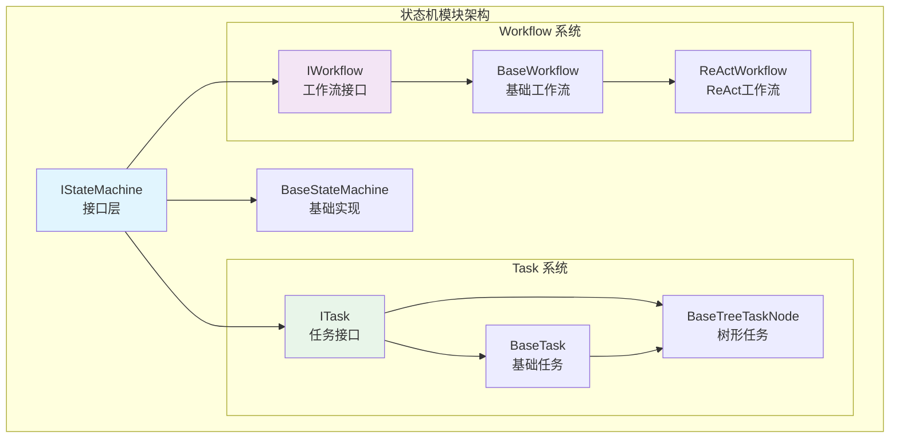
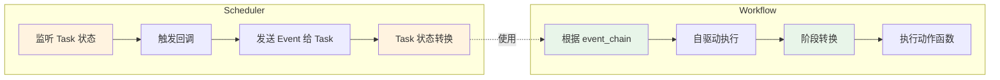

# 状态机模块文档

> Tasking 状态机模块提供基于接口的任务状态管理，支持上下文感知、层次化任务组合和工作流执行。

## 目录

- [模块概览](#模块概览)
- [Task 系统](#task-系统)
- [Workflow 系统](#workflow-系统)
- [使用示例](#使用示例)
- [与调度器集成](#与调度器集成)

---

## 模块概览



### 模块结构
```
src/core/state_machine/
├── interface.py           # 基础状态机接口
├── base.py               # 基础状态机实现
├── const.py              # 通用类型定义
├── task/                 # 任务子模块
│   ├── interface.py      # 任务接口
│   ├── base.py           # 任务基础实现
│   ├── tree.py           # 树形任务实现
│   ├── tree_node_builder.py # 任务构建器
│   └── const.py          # 任务状态和事件定义
└── workflow/             # 工作流子模块
    ├── interface.py      # 工作流接口
    ├── base.py           # 工作流基础实现
    └── const.py          # 工作流阶段和事件定义
```


---

## Task 系统

### 核心接口

```python
# 基础状态机接口
IStateMachine[StateT, EventT]
  ├── 状态管理：编译、重置、事件处理
  └── 转换规则：设置状态转换规则

# 任务接口（继承状态机）
ITask[StateT, EventT]
  ├── 任务属性：标签、协议定义
  ├── 输入输出：数据管理和协议设置
  └── 错误处理：错误状态和信息管理

# 树形任务接口（继承任务）
ITreeTaskNode[StateT, EventT]
  ├── 节点关系：父子关系管理
  ├── 深度计算：当前深度和最大深度
  └── 子任务管理：添加、移除子任务
```

### 状态与事件

```python
from src.core.state_machine.task.const import TaskState, TaskEvent

# 任务状态
TaskState.INITED    # 初始化
TaskState.CREATED   # 创建
TaskState.RUNNING   # 执行中
TaskState.FINISHED  # 完成
TaskState.FAILED    # 失败
TaskState.CANCELED  # 取消

# 任务事件
TaskEvent.IDENTIFIED  # 目标已确认
TaskEvent.PLANED      # 完成规划
TaskEvent.DONE        # 执行完成
TaskEvent.ERROR       # 执行错误
TaskEvent.RETRY       # 重试
TaskEvent.CANCEL      # 取消
```

### 创建任务

```python
from src.core.state_machine.task import build_base_tree_node
from src.core.state_machine.task.const import TaskState, TaskEvent
from src.model.llm import CompletionConfig

# 使用构建器创建任务
task = build_base_tree_node(
    protocol="example_protocol_v1.0",
    tags={"example", "test"},
    task_type="demo_task",
    max_depth=3,
    completion_config=CompletionConfig(),
)

# 编译状态机（必须在使用前调用）
task.compile(max_revisit_count=3)

# 设置任务属性
task.set_title("示例任务")
task.set_input({"data": "raw_data"})
```

### Protocol 和 Template

Task 的 **protocol** 定义了任务的输入输出格式规范，**template** 提供了具体的示例模板。

```python
# 定义任务的 protocol - 输入输出格式规范
task_protocol = {
    "input_schema": {
        "type": "object",
        "properties": {
            "text": {"type": "string", "description": "待处理的文本"},
            "language": {"type": "string", "enum": ["zh", "en"], "default": "zh"}
        },
        "required": ["text"]
    },
    "output_schema": {
        "type": "object",
        "properties": {
            "summary": {"type": "string", "description": "文本摘要"},
            "sentiment": {"type": "string", "enum": ["positive", "negative", "neutral"]},
            "confidence": {"type": "number", "minimum": 0, "maximum": 1}
        },
        "required": ["summary", "sentiment"]
    }
}

# 定义任务的 template - 具体示例
task_template = {
    "input_example": {
        "text": "今天天气真好，心情很愉快",
        "language": "zh"
    },
    "output_example": {
        "summary": "表达对好天气和愉快心情的感受",
        "sentiment": "positive",
        "confidence": 0.95
    }
}

# 获取任务信息
print(f"任务协议: {task.get_protocol()}")  # 获取 protocol
print(f"任务模板: {task.get_template()}")   # 获取 template
print(f"任务类型: {task.get_task_type()}")  # 获取任务类型
print(f"任务标签: {task.get_tags()}")        # 获取任务标签

# 实际使用 - 设置符合 protocol 的输入
task.set_input({
    "text": "这个产品功能很强大，但是价格有点贵",
    "language": "zh"
})

# 任务完成后设置符合 protocol 的输出
task.set_completed(
    output='{"summary": "产品功能强大但价格偏高", "sentiment": "neutral", "confidence": 0.8}'
)
```

### 树形任务结构

```python
# 创建根任务
root_task = build_base_tree_node(
    protocol="workflow_v1.0",
    tags={"workflow", "root"},
    task_type="root_task",
    max_depth=3,
    completion_config=CompletionConfig(),
)

# 创建子任务
subtask = build_base_tree_node(
    protocol="step_v1.0",
    tags={"workflow", "step"},
    task_type="subtask",
    max_depth=3,
    completion_config=CompletionConfig(),
)

# 构建树形结构
root_task.add_sub_task(subtask)

# 查询树形信息
print(f"根任务深度: {root_task.get_current_depth()}")      # 0
print(f"子任务深度: {subtask.get_current_depth()}")        # 1
print(f"根任务是否为根: {root_task.is_root()}")            # True
print(f"子任务是否为叶子: {subtask.is_leaf()}")             # True
```

### 上下文管理

```python
from src.model.message import Message, Role

# 每个状态维护独立的上下文
running_context = task.get_context(TaskState.RUNNING)

# 添加上下文数据
message = Message(role=Role.SYSTEM, content="处理进度：50%")
running_context.append_context_data(message)

# 获取上下文数据
context_data = running_context.get_context_data()  # list[Message]
```

---

## Workflow 系统

### 核心概念

Workflow 是一个**自驱动的状态机**，具有以下特点：

- **自驱动**：Workflow 根据自己的 `event_chain` 进行状态转换，不需要外部调度器
- **不关心 Task 状态**：Workflow 执行阶段化流程（如推理、行动、反思），但不直接处理 Task 的状态
- **阶段导向**：Workflow 关注的是执行阶段的推进，而非任务的生命周期管理
- **有限状态机**：Workflow 是一个必须能达到终点的图数据结构，通过 event_chain 确保终态可达性

### 核心接口

```python
# 工作流接口
IWorkflow[WorkflowStageT, WorkflowEventT, StateT, EventT]
  ├── 阶段管理：工作流阶段定义
  ├── 动作管理：阶段转换的动作函数
  └── 工具集成：支持工具调用
```

### Workflow vs Scheduler 的区别



**关键区别**：
- **Scheduler**：状态驱动，监听 Task 状态变化并触发处理
- **Workflow**：事件驱动，按预设的 event_chain 自主推进

### ReAct 工作流示例

```python
from src.core.state_machine.workflow.const import ReActStage, ReActEvent
from src.core.state_machine.workflow.base import BaseWorkflow

# 创建 ReAct 工作流
workflow = BaseWorkflow[ReActStage, ReActEvent, TaskState, TaskEvent](
    valid_states=set(ReActStage),
    init_state=ReActStage.INIT,
    transitions={
        (ReActStage.INIT, ReActEvent.REASON): (ReActStage.REASONING, None),
        (ReActStage.REASONING, ReActEvent.ACT): (ReActStage.ACTION, None),
        (ReActStage.ACTION, ReActEvent.REFLECT): (ReActStage.REFLECTION, None),
        (ReActStage.REFLECTION, ReActEvent.FINISH): (ReActStage.END, None),
    },
    name="react_workflow",
    labels={"output": "OUTPUT", "reasoning": "REASONING"},
    actions={},  # 动作函数
    prompts={},  # 提示模板
    observe_funcs={},  # 观察函数
    event_chain=[
        ReActEvent.REASON,
        ReActEvent.ACT,
        ReActEvent.REFLECT,
        ReActEvent.FINISH
    ],
    end_workflow=None  # 结束工作流工具
)

# 编译工作流
workflow.compile(max_revisit_count=5)
```

## 使用示例

### 基础任务使用

```python
import asyncio
from src.core.state_machine.task import build_base_tree_node
from src.core.state_machine.task.const import TaskState, TaskEvent
from src.model.llm import CompletionConfig

async def main():
    # 创建任务
    task = build_base_tree_node(
        protocol="data_processing_v1.0",
        tags={"data", "processing"},
        task_type="processing_task",
        max_depth=3,
        completion_config=CompletionConfig(),
    )

    # 编译状态机
    task.compile(max_revisit_count=3)

    # 查看初始状态
    print(f"初始状态: {task.get_current_state()}")
    print(f"任务ID: {task.get_id()}")

    # 设置输入输出
    task.set_input({"data": "raw_data"})
    # 在实际执行后设置输出
    # task.set_completed(output='{"result": "processed_data"}')

if __name__ == "__main__":
    asyncio.run(main())
```

### 完整示例：任务创建与状态管理

```python
from src.core.state_machine.task import build_base_tree_node
from src.core.state_machine.task.const import TaskState, TaskEvent
from src.model.message import Message, Role
from src.model.llm import CompletionConfig

# 创建任务
task = build_base_tree_node(
    protocol="example_v1.0",
    tags={"example"},
    task_type="demo_task",
    max_depth=3,
    completion_config=CompletionConfig(),
)

# 编译状态机
task.compile(max_revisit_count=3)

# 设置任务属性
task.set_title("示例任务")
task.set_input({"query": "example query"})

# 上下文管理
running_context = task.get_context(TaskState.RUNNING)
message = Message(role=Role.USER, content="开始执行任务")
running_context.append_context_data(message)

# 获取上下文数据
context_data = running_context.get_context_data()
print(f"上下文消息数: {len(context_data)}")

# 错误处理
task.set_error_info("示例错误信息")
if task.is_error():
    print(f"错误信息: {task.get_error_info()}")
    task.clean_error_info()  # 清除错误信息
```


---

## 与调度器集成

状态机与调度器协同工作，实现任务的自动化调度：

```python
from src.core.scheduler.simple import create_simple_scheduler
from src.core.state_machine.task import build_base_tree_node
from src.core.state_machine.task.const import TaskState, TaskEvent
from src.model.llm import CompletionConfig
from queue import Queue

# 创建任务
task = build_base_tree_node(
    protocol="integration_v1.0",
    tags={"integration"},
    task_type="integration_task",
    max_depth=3,
    completion_config=CompletionConfig(),
)

# 编译任务
task.compile(max_revisit_count=3)

# 创建调度器（需要配置 Agent）
# scheduler = create_simple_scheduler(executor=agent, max_error_retry=3)

# 执行调度
# context = {"user_id": "user123"}
# queue = Queue[Message]()
# await scheduler.schedule(context=context, queue=queue, fsm=task)
```

---

## 最佳实践

1. **编译前必须配置**：状态机和使用前必须调用 `compile()`
2. **使用构建器**：优先使用 `build_base_tree_node` 等构建函数
3. **错误处理**：使用 `set_error_info()` 和 `clean_error_info()` 管理错误状态
4. **上下文隔离**：每个状态维护独立上下文，避免数据污染
5. **循环控制**：设置合理的 `max_revisit_count` 防止无限循环

**最后更新**: 2025-11-11
