# Tasking 开发者指南

> 本文档面向希望使用或扩展 Tasking 框架的开发者，详细介绍核心模块的设计原理、API 使用和最佳实践。

## 目录

- [系统架构概览](#系统架构概览)
- [项目结构](#项目结构)
- [快速开始](#快速开始)
- [核心模块简介](#核心模块简介)
- [开发实践](#开发实践)
- [详细文档](#详细文档)

---

## 系统架构概览

Tasking 是一个基于状态机的任务驱动智能体框架，核心架构采用 **Agent ↔ Workflow ↔ Task ↔ Scheduler** 协作模式：

```mermaid
graph TB

    subgraph "Scheduler 调度器层"
        S[Scheduler]
    end

    subgraph "Agent 智能体层"
        A[Agent]
    end

    subgraph "Workflow 工作流层"
        W[Workflow]
    end

    subgraph "Task 任务状态机层"
        T[Task]
    end

    A -->|run_task_stream| W
    W -->|驱动状态转换| T
    T -->|状态变更通知| S
    S -->|执行任务| A

    style A fill:#e1f5fe
    style W fill:#f3e5f5
    style T fill:#e8f5e9
    style S fill:#fff3e0
```



## 项目结构

```plaintext
tasking/
├── 📁 core/                     # 核心框架模块
│   ├── 📁 agent/               # 智能体框架
│   │   ├── 📄 README.md        # Agent 模块详细文档
│   │   ├── 📄 interface.py     # IAgent 接口定义
│   │   ├── 📄 base.py          # 智能体基础实现
│   │   ├── 📄 react.py         # React 模式智能体实现
│   │   ├── 📄 reflect.py       # Reflect 模式智能体实现
│   │   ├── 📄 orchestrate.py   # Orchestrate 模式智能体
│   │   └── 📄 __init__.py
│   ├── 📁 context/             # 上下文管理系统
│   │   ├── 📄 interface.py     # IContextual 接口
│   │   ├── 📄 base.py          # 上下文基础实现
│   │   └── 📄 __init__.py
│   ├── 📁 middleware/          # 中间件系统
│   │   ├── 📄 step_counter.py  # 步数计数中间件
│   │   ├── 📄 memory.py        # 记忆管理中间件
│   │   ├── 📄 human.py         # 人工交互中间件
│   │   └── 📄 __init__.py
│   ├── 📁 scheduler/           # 任务调度系统
│   │   ├── 📄 README.md        # Scheduler 模块详细文档
│   │   ├── 📄 interface.py     # IScheduler 接口
│   │   ├── 📄 base.py          # 基础调度器
│   │   ├── 📄 task.py          # 任务调度器实现
│   │   └── 📄 __init__.py
│   ├── 📁 state_machine/       # 状态机核心
│   │   ├── 📄 README.md        # 状态机模块详细文档
│   │   ├── 📄 interface.py     # 状态机接口
│   │   ├── 📄 base.py          # 基础实现
│   │   ├── 📄 const.py         # 状态和事件枚举
│   │   ├── 📁 task/            # 任务子模块
│   │   │   ├── 📄 interface.py
│   │   │   ├── 📄 base.py
│   │   │   ├── 📄 tree.py
│   │   │   ├── 📄 tree_node_builder.py
│   │   │   ├── 📄 const.py
│   │   │   └── 📄 __init__.py
│   │   ├── 📁 workflow/        # 工作流子模块
│   │   │   ├── 📄 interface.py
│   │   │   ├── 📄 base.py
│   │   │   ├── 📄 const.py
│   │   │   └── 📄 __init__.py
│   │   └── 📄 __init__.py
│   └── 📄 __init__.py
├── 📁 database/                # 数据库模块
│   ├── 📄 interface.py         # 数据库接口
│   ├── 📄 sqlite.py            # SQLite 数据库实现
│   ├── 📄 milvus.py            # Milvus 向量数据库实现
│   └── 📄 __init__.py
├── 📁 llm/                     # 大语言模型集成
│   ├── 📄 interface.py         # ILLM 接口
│   ├── 📄 openai.py            # OpenAI 实现
│   ├── 📄 anthropic.py         # Anthropic Claude 实现
│   ├── 📄 ark.py               # 火山引擎 Ark 实现
│   ├── 📄 zhipu.py             # 智谱 AI 实现
│   ├── 📄 utils.py             # LLM 工具函数
│   ├── 📄 const.py             # LLM 提供商类型
│   └── 📄 __init__.py
├── 📁 model/                   # 数据模型
│   ├── 📄 message.py           # 消息和角色定义
│   ├── 📄 llm.py              # LLM 配置类
│   ├── 📄 setting.py           # 设置模型
│   ├── 📄 human.py             # 人工交互模型
│   ├── 📄 queue.py             # 队列模型
│   └── 📄 __init__.py
├── 📁 tool/                    # 工具模块
│   ├── 📄 intent.py            # 意图识别工具
│   ├── 📄 terminal.py          # 终端工具
│   ├── 📄 text_edit.py         # 文本编辑工具
│   └── 📄 __init__.py
├── 📁 utils/                   # 工具模块
│   ├── 📄 io.py                # IO 工具
│   ├── 📄 content.py           # 内容处理工具
│   ├── 📁 string/              # 字符串工具
│   │   ├── 📄 extract.py
│   │   └── 📄 __init__.py
│   └── 📄 __init__.py
├── 📄 README.md                # 开发者详细指南
├── 📄 __init__.py
└── 📄 py.typed                  # 类型提示标记文件
```

---

## 核心流程

1. 调度器 schedule 流程

```mermaid
graph TB
    ScheduleStart[调度器入口]
    ScheduleStart --> ReadState[读取 Task 当前状态]
    ReadState -->|否| SelectHandler{根据状态选择调度函数}
    SelectHandler --> CallHandler[调度函数<br/>执行业务逻辑<br/>]
    HandlerReturn --> TaskHandle[将 Event 发送给 Task 执行处理]
    TaskHandle --> OnStateChanged[调度器后处理：on_state_changed]
    %% 后处理完成后回到“根据状态选择调度函数”进行最终判断
    OnStateChanged --> ReadState{是否为结束状态？}
    ReadState -->|是| END

    subgraph "Workflow - 自驱动事件链"
        W1[Agent 执行任务] --> W2[获取第一个工作流事件<br/>event_chain_0]
        W2 --> W3[执行工作流动作]
        W3 --> W4[触发下一个 工作流Event]
        W4 --> W5[event_chain_1]
        W5 --> W3
        W3 -->|到达终态| W6[Workflow 结束]
    end

    CallHandler --> W1
    W6 --> HandlerReturn[调度函数返回 Event 或 None]

    %% 说明与样式（便于阅读）
    style ScheduleStart fill:#e1f5fe,stroke:#90caf9
    style ReadState fill:#fff3e0
    style SelectHandler fill:#fff9c4
    style CallHandler fill:#f3e5f5
    style HandlerReturn fill:#fff8e1
    style TaskHandle fill:#e8f5e9
    style OnStateChanged fill:#fce4ec
```


2. 工作流 Action 循环
```mermaid
graph TB
    %% 1. 外层基础节点（流程起点/终点/循环判断）
    A[Agent 执行任务]
    B{Observe-Think-Act <br/>工作流动作循环}
    P[结束]

    %% 2. 核心执行循环
    subgraph Action 循环
        C[Pre-Run Hooks<br/>修改运行前上下文]
        O[Post-Run Hooks<br/>修改运行后上下文]

        %% 2.1 Observe 阶段
        subgraph Observe阶段
            D[Pre-Observe Hooks<br/>修改观察信息]
            E[实际观察]
            F[Post-Observe Hooks<br/>处理观察结果]
            D --> E
            E --> F
        end

        %% 2.2 Think 阶段
        subgraph Think阶段
            H[Pre-Think Hooks<br/>修改大模型推理输入]
            I[实际思考]
            J[Post-Think Hooks<br/>修改大模型推理输出]
            H --> I
            I --> J
        end

        %% 2.3 Act 阶段
        subgraph Act阶段
            L[Pre-Act Hooks<br/>处理大模型Act请求]
            M[实际执行]
            N[Post-Act Hooks<br/>执行后处理]
            L --> M
            M --> N
        end

        F --> H 
        J --> L 
    end

    %% 4. 外层完整流程（全用具体节点连接，无歧义）
    A --> B
    B --> C
    C --> D
    N --> O
    O --> B
    B --> P

    %% 在结束后发送一个工作流事件，并交给工作流处理
    P --> ReturnEvent[返回工作流事件<br/>Return Workflow Event]
    ReturnEvent --> WorkflowHandler[Workflow 引擎状态转换处理]
    WorkflowHandler -.-> Note_Workflow[此事件将交由工作流进行状态转换处理]

    %% 各阶段 hook 着色（按阶段统一）
    %% Pre-Run Hooks（整体/外层） - 淡蓝
    style C fill:#e1f5fe
    %% Post-Run Hooks（整体/外层） - 淡蓝
    style O fill:#e1f5fe    

    %% Pre-Observe Hooks - 观察阶段（淡橙）
    style D fill:#fff3e0    
    %% Post-Observe Hooks - 观察阶段（淡橙）
    style F fill:#fff3e0    

    %% Pre-Think Hooks - 思考阶段（淡绿）
    style H fill:#e8f5e9    
    %% Post-Think Hooks - 思考阶段（淡绿）
    style J fill:#e8f5e9    

    %% Pre-Act Hooks - 执行阶段（淡粉）
    style L fill:#fce4ec    
    %% Post-Act Hooks - 执行阶段（淡粉）
    style N fill:#fce4ec    

    %% 为每个钩子添加右侧的虚线笔记占位（我来填写内容）
    C -.-> Note_PreRun[按照任务类型，加载必要的记忆内容，如和任务执行相关的“命令型记忆”]
    O -.-> Note_PostRun[对上下文进行关键信息提取/压缩/折叠等操作]

    D -.-> Note_PreObserve[按照任务类型，加载必要的依赖信息，如树型任务加载其父类的观察信息]
    F -.-> Note_PostObserve[根据观察信息检索相应的“事件型记忆”，类似于人类的“看到某些情景就想起某些事”]

    H -.-> Note_PreThink[可以用来将必要信息进行替换，如替换真实邮箱地址为虚拟邮箱地址，也可以在这里将观察阶段的上下文进行处理后输出到输出队列]
    J -.-> Note_PostThink[可以将之前替换的内容替换回实际内容，也可以在这里将大模型推理内容处理后输出到输出队列]

    L -.-> Note_PreAct[可以检查大模型执行该工具的许可，或者发起工具调用批准请求]
    N -.-> Note_PostAct[可以通过回调函数向输出队列发送工具调用结果]

    %% 新增工作流事件的笔记样式
    style Note_Workflow fill:#fffde7,stroke:#f0e68c

    %% 其他笔记样式（统一浅黄背景）
    style Note_PreRun fill:#fffde7,stroke:#f0e68c
    style Note_PostRun fill:#fffde7,stroke:#f0e68c
    style Note_PreObserve fill:#fffde7,stroke:#f0e68c
    style Note_PostObserve fill:#fffde7,stroke:#f0e68c
    style Note_PreThink fill:#fffde7,stroke:#f0e68c
    style Note_PostThink fill:#fffde7,stroke:#f0e68c
    style Note_PreAct fill:#fffde7,stroke:#f0e68c
    style Note_PostAct fill:#fffde7,stroke:#f0e68c

    %% 保留其他节点样式
    style B fill:#e1f5fe
    style P fill:#f3e5f5
    style WorkflowHandler fill:#f8bbd9,stroke:#d0a3d0
```

---

## 核心模块简介

### Task 模块

**任务生命周期管理**
- 基于状态机的任务生命周期：INITED → CREATED → RUNNING → FINISHED/FAILED/CANCELED
- 支持树形层次结构，任务可分解为子任务
- 每个状态维护独立的上下文数据

```mermaid
stateDiagram-v2
    [*] --> INITED: 初始化
    INITED --> CREATED: IDENTIFIED
    CREATED --> RUNNING: PLANED
    RUNNING --> FINISHED: DONE
    RUNNING --> FAILED: ERROR
    FAILED --> RUNNING: RETRY
    FAILED --> CANCELED: CANCEL
    FINISHED --> [*]
    CANCELED --> [*]
```



**创建任务示例**
```python
from tasking.core.state_machine.task import build_base_tree_node
from tasking.model.llm import CompletionConfig

# 创建基础任务
task = build_base_tree_node(
    protocol="example_v1.0",
    tags={"example"},
    task_type="demo_task",
    max_depth=3,
)

# 设置输入输出
task.set_input({"data": "example_data"})
task.set_completed(output='{"result": "success"}')
```

### Workflow 模块

**阶段化执行流程**（自驱动）
- 支持 ReAct（Reason-Act-Reflect）等执行模式
- 根据 event_chain 自主推进，不关心 Task 状态
- 每个阶段配置动作函数和提示模板
- Workflow 是必须能达到终点的有限状态机

### Scheduler 模块

**任务调度编排**（状态驱动）
- 监听 Task 状态变化并触发回调
- 根据 Task 状态进行调度和后续处理
- 通过发送 Event 驱动 Task 状态转换
- Task 是必须能达到终点的有限状态机

### Scheduler vs Workflow 的关键区别

| 特性 | Scheduler | Workflow |
|------|-----------|----------|
| **驱动方式** | 状态驱动（监听 Task 状态） | 事件驱动（按 event_chain） |
| **关注点** | Task 的生命周期管理 | 阶段化执行流程 |
| **状态转换** | 发送 Event 给 Task | 自主进行阶段转换 |
| **依赖关系** | 可调度 Workflow（通过 Agent 的 `run_task_stream` 接口） | 被 Scheduler 调用 |

```mermaid
graph TD
    subgraph "Scheduler - 状态驱动"
        S1[监听 Task 状态] --> S2[触发回调]
        S2 --> S3[执行处理逻辑]
        S3 --> S4[发送 Event]
    end

    subgraph "Workflow - 自驱动"
        W1[event_chain_0] --> W2[阶段1执行]
        W2 --> W3[event_chain_1]
        W3 --> W4[阶段2执行]
    end

    S4 -.->|调用| W1

    style S1 fill:#fff3e0
    style S4 fill:#fff3e0
    style W1 fill:#e8f5e9
    style W2 fill:#e8f5e9
```



### Agent Hooks 机制

**扩展点钩子**
- 预置和后置钩子覆盖整个执行流程
- 支持日志记录、性能监控、错误处理等
- 按注册顺序执行，支持同步/异步

---

#### 职责划分
- 工作流（Workflow）本身“不感知任务状态”。Workflow 的职责是按动作序列运行并产生“工作流事件”（workflow events），驱动工作流内部的自驱动流转与动作输出。为保证执行语义一致，所有 Workflow 的 action 应通过 Agent 的 observe/think/act 接口唤起对应阶段行为并返回工作流事件；若无法构成完整动作循环，请使用 Agent hooks 进行拦截或补充。
- 调度器的 ***调度函数*** 必须返回用于驱动任务状态变化的“任务事件”（task events）。调度器负责将该任务事件交给 Task（task.handle_event），并在 Task 状态变化后执行调度器的后处理逻辑（on_state_changed）。

> 简言之：Workflow 产生 workflow events；Scheduler 产生并消费 task events；只有 Scheduler 感知并控制 Task 的状态流转。


### 开发规范

- 修改 Agent 的 Hook（Agent hooks）
  - 可在 Agent 层加入拦截/预处理/后处理逻辑（如日志、缓存、流式响应控制等），影响任务执行上下文或消息流。

- 自定义 Workflow 的 action（Workflow Actions）
  - 每个 Workflow 的 action 都应通过 Agent 的 observe/think/act 调用来组成一个完整的 action，从而产生用于驱动工作流自身变化的工作流事件（workflow events）。若某个操作并非完整的 O/T/A 动作组合，则应考虑实现为 Agent 的 Hook（pre/post）而非定义新的 workflow 状态以及对应的 action。
  - 修改或新增工作流状态（如Execute/Reflect）来改变工作流行为。每个状态应维护对应的提示词以及 action 函数，每个 action 应返回工作流事件以驱动工作流内的进一步流转。

- 定制调度器行为（Scheduler）
  - 通过实现/替换调度函数（on_state_fn）来自定义当 Task 处于某状态时的业务执行逻辑（必须返回 task event 或 None）。
  - 通过实现状态变更后处理函数（on_state_changed_fn）来自定义在 Task 状态变更后需要执行的后处理逻辑（注意：后处理不会再次触发 on_state_changed 的循环）。

---

## 详细文档

各模块的详细说明请参考：

- **[状态机模块详解](./core/state_machine/README.md)** - Task、Workflow、状态机的详细使用
- **[Agent 模块](./core/agent/README.md)** - Agent 和 Hooks 机制（ReAct 功能开发中[WIP]）
- **[Scheduler 模块](./core/scheduler/README.md)** - 任务调度和编排（ReAct 功能开发中[WIP]）

**注意事项**：

1. 使用 `uv` 管理环境和依赖
2. 所有代码必须通过 pyright 和 pylint 检查
3. 测试覆盖率需达到 80%

---

**最后更新**: 2025-11-11
