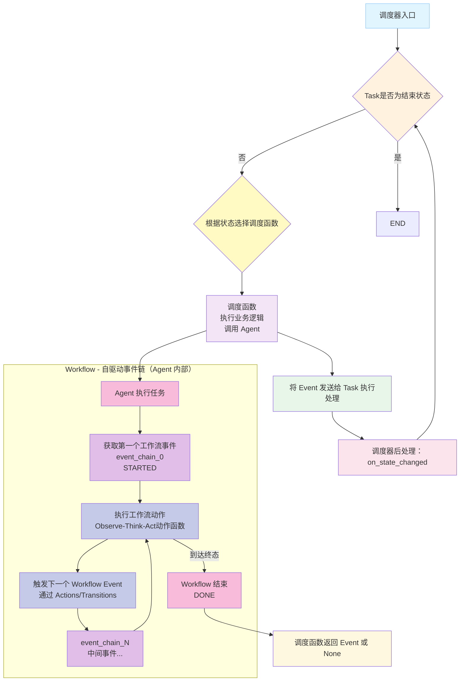
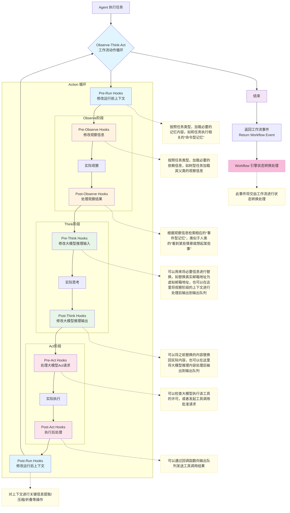

# Agent 工作流系统

本文档旨在帮助开发者由浅入深地理解 Agent 工作流系统的设计和实现，并提供清晰的开发指导。通过阅读本文档，你将了解 Agent 的核心工作原理、架构设计以及如何实现自定义的工作流。

## 📚 文档导航

- **架构概览**: 通过可视化架构图理解 Agent 系统的组件关系
- **核心概念**: 深入了解 Agent、Action、Transition 等核心概念
- **开发指南**: 分步骤说明如何创建新的 Agent 工作流
- **Hook 机制**: 了解如何扩展和自定义 Agent 行为

## 🏗️ 系统架构



根据架构图，Agent 系统由以下核心部分组成：

### 系统组件

1. **Agent（智能体）** - 被调度的执行主体
   - 接收 Scheduler 的调用
   - 启动并执行 Workflow

2. **Workflow（工作流）** - 自驱动的事件链系统
   - 通过 event_chain 定义执行序列
   - 在每个事件中执行 Observe-Think-Act 动作函数
   - 通过 Actions 和 Transitions 控制流程推进
   - 自主执行，不关心外部 Task 状态

3. **Actions（行动）** - Workflow 的具体执行单元
   - SelectToolAction：选择合适的工具
   - CallToolAction：调用选定的工具
   - ParseResultAction：解析工具执行结果

4. **Transitions（转移）** - Workflow 状态转移条件
   - ShouldSelectTool：判断是否需要选择工具
   - ShouldCallTool：判断是否应该调用工具
   - ShouldParseResult：判断是否需要解析结果

### 执行流程

1. **调度阶段**：
   - Scheduler 监听 Task 状态变化
   - 当 Task 进入特定状态（如 RUNNING）时触发调度
   - 调度函数调用对应的 Agent

2. **执行阶段**：
   - Agent 被调用后启动 Workflow
   - Workflow 获取第一个事件（STARTED）
   - 执行 Observe-Think-Act 动作函数
   - 通过 Actions 执行具体任务
   - 通过 Transitions 决定下一个事件

3. **完成阶段**：
   - Workflow 到达终态
   - 返回 **任务事件** 给 Scheduler
   - Scheduler 更新 Task 状态并执行后处理

### 关键特点

- **关注点分离**：Scheduler 管理 Task 生命周期，Workflow 管理具体执行逻辑
- **自驱动执行**：Workflow 一旦启动就按事件链自主推进
- **灵活扩展**：通过 Actions/Transitions 和工具接口支持功能扩展

## 🔧 Agent 工作流开发指南

参照[orchestrate.py](./orchestrate.py)，创建一个新的 Agent 工作流需要定义以下六个核心部分：

### 1. 定义 Workflow Stage 以及对应的驱动事件 Workflow Event

工作流通过事件链驱动，需要先定义业务需求的 **工作流状态** 以及对应的 **驱动事件**。
在编排工作流中，编排需要对内容进行思考，然后执行编排的动作，将任务拆分成子树。

```python
class OrchestrateStage(str, Enum):
    """Orchestrate 工作流阶段枚举"""
    THINKING = "thinking"
    ORCHESTRATING = "orchestrating"
    FINISHED = "finished"
    
    @classmethod
    def list_stages(cls) -> list['OrchestrateStage']:
        """列出所有工作流阶段
        
        Returns:
            工作流阶段列表
        """
        return [stage for stage in OrchestrateStage]


class OrchestrateEvent(Enum):
    """Orchestrate 工作流事件枚举"""
    THINK = auto()          # 触发思考
    ORCHESTRATE = auto()    # 触发编排
    FINISH = auto()         # 触发完成

    @property
    def name(self) -> str:
        """获取事件名称"""
        return self._name_.lower()


def get_orch_stages() -> set[OrchestrateStage]:
    """获取 Think - Orchestrate - Finish 工作流的阶段
    - THINKING, ORCHESTRATING, FINISHED
    
    Returns:
        orchestrate 工作流的阶段集合
    """
    return {
        OrchestrateStage.THINKING,
        OrchestrateStage.ORCHESTRATING,
        OrchestrateStage.FINISHED,
    }
    

def get_orch_event_chain() -> list[OrchestrateEvent]:
    """获取编排工作流事件链
    -  THINK, ORCHESTRATE, FINISH

    Returns:
        orchestrate工作流事件链
    """
    return [
        OrchestrateEvent.THINK,
        OrchestrateEvent.ORCHESTRATE,
        OrchestrateEvent.FINISH,
    ]
```

**关键事件**：
- **启动事件**: 工作流开始的第一个事件
- **中间事件**: 执行过程中的各种状态变化
- **结束事件**: 工作流完成的最后一个事件

**开发要点**：
- 明确定义启动和结束事件
- 确保事件链的完整性和逻辑性
- 避免无限循环或无法到达结束状态

### 2. 定义 Actions（行动）

Actions 是工作流的基本执行单元，用于根据工作流状态执行具体任务。每个 Action 负责一个特定的执行步骤。

```python
def get_orch_actions(
    agent: IAgent[OrchestrateStage, OrchestrateEvent, TaskState, TaskEvent],
) -> dict[
    OrchestrateStage, 
    Callable[
        [
            IWorkflow[OrchestrateStage, OrchestrateEvent, TaskState, TaskEvent],
            dict[str, Any],
            IQueue[Message],
            ITask[TaskState, TaskEvent],
        ], 
        Awaitable[OrchestrateEvent]
    ]
]:
    """获取 Orchestrate 工作流动作定义
    -  THINKING: thinking_action
    -  CHECKING: checking_action
    -  ORCHESTRATING: orchestrating_action

    Args:
        agent (IAgent): 关联的智能体实例

    Returns:
        常用工作流动作定义
    """
    actions: dict[OrchestrateStage, Callable[
        [
            IWorkflow[OrchestrateStage, OrchestrateEvent, TaskState, TaskEvent],
            dict[str, Any],
            IQueue[Message],
            ITask[TaskState, TaskEvent],
        ], 
        Awaitable[OrchestrateEvent]]
    ] = {}
    
    # THINKING 阶段动作定义
    async def think(
        workflow: IWorkflow[OrchestrateStage, OrchestrateEvent, TaskState, TaskEvent],
        context: dict[str, Any],
        queue: IQueue[Message],
        task: ITask[TaskState, TaskEvent],
    ) -> OrchestrateEvent:
        """THINKING 阶段动作函数
        
        Args:
            context (dict[str, Any]): 上下文字典，用于传递用户ID/AccessToken/TraceID等信息
            queue (IQueue[Message]): 数据队列，用于输出数据
            workflow (IWorkflow[OrchestrateStage, OrchestrateEvent, TaskState, TaskEvent]): 工作流实例
            task (ITask[TaskState, TaskEvent]): 任务实例

        Returns:
            OrchestrateEvent: 触发的事件类型
        """
        # 获取当前工作流的状态
        current_state = workflow.get_current_state()
        if current_state != OrchestrateStage.THINKING:
            raise RuntimeError(f"当前工作流状态错误，期望：{OrchestrateStage.THINKING}，实际：{current_state}")

        # 获取当前工作流的提示词
        prompt = workflow.get_prompt()
        # 创建新的任务消息
        message = Message(role=Role.USER, content=prompt)
        # 添加 message 到当前任务上下文
        task.get_context().append_context_data(message)
        # 观察 Task
        observe = await agent.observe(
            context=context,
            queue=queue,
            task=task,
            observe_fn=workflow.get_observe_fn(),
        )
        try:
            # 开始 LLM 推理
            message = await agent.think(
                context=context,
                queue=queue,
                llm_name=current_state.name, 
                observe=observe, 
                completion_config=workflow.get_completion_config(),
            )
            # 推理结果反馈到任务
            task.get_context().append_context_data(message)
        except HumanInterfere as e:
            # 将人类介入信息反馈到任务
            result = Message(
                role=Role.USER,
                content=str(e),
                is_error=True,
            )
            # 记录到任务上下文
            task.get_context().append_context_data(result)
            # 返回 THINK 事件重新思考
            return OrchestrateEvent.THINK
        
        # 允许执行工具标志位
        allow_tool: bool = True
        
        if message.stop_reason == StopReason.TOOL_CALL:
            # Act on the task or environment
            for tool_call in message.tool_calls:
                # 检查工具执行许可
                if not allow_tool:
                    # 生成错误信息
                    result = Message(
                        role=Role.TOOL,
                        tool_call_id=tool_call.id,
                        is_error=True,
                        content="由于前置工具调用出错，后续工具调用被禁止继续执行"
                    )
                    continue
                
                try:
                    # 开始执行工具，如果是工具服务的工具，则 task/workflow 不会被注入到参数中
                    result = await agent.act(
                        context=context,
                        queue=queue,
                        tool_call=tool_call,
                        task=task,
                        workflow=workflow,
                    )
                except HumanInterfere as e:
                    # 将人类介入信息反馈到任务
                    result = Message(
                        role=Role.USER,
                        content=str(e),
                        is_error=True,
                    )
                    # 禁止后续工具调用执行
                    allow_tool = False
                    
                # 工具调用结果反馈到任务
                task.get_context().append_context_data(result)
                # 检查调用错误状态
                if result.is_error:
                    # 将任务设置为错误状态
                    task.set_error(result.content)
                    # 停止执行剩余的工具
                    allow_tool = False

        if not allow_tool or task.is_error():
            # 调用了工具，但出现错误，或者计划没有被批准，返回 THINK 事件重新思考
            return OrchestrateEvent.THINK
        
        # 正常完成思考，开始编排
        return OrchestrateEvent.ORCHESTRATE
    
    # 添加到动作定义字典
    actions[OrchestrateStage.THINKING] = think
    
    # ORCHESTRATING 阶段动作定义
    async def orchestrate(
        workflow: IWorkflow[OrchestrateStage, OrchestrateEvent, TaskState, TaskEvent],
        context: dict[str, Any],
        queue: IQueue[Message],
        task: ITask[TaskState, TaskEvent],
    ) -> OrchestrateEvent:
        """ORCHESTRATING 阶段动作函数
        
        Args:
            context (dict[str, Any]): 上下文字典，用于传递用户ID/AccessToken/TraceID等信息
            queue (IQueue[Message]): 数据队列，用于输出数据
            workflow (IWorkflow[OrchestrateStage, OrchestrateEvent, TaskState, TaskEvent]): 工作流实例
            task (ITask[TaskState, TaskEvent]): 任务实例

        Returns:
            OrchestrateEvent: 触发的事件类型
        """
        ...

        # 获取任务的推理配置
        completion_config = workflow.get_completion_config()
        # 要求输出必须格式化为JSON
        completion_config.update(format_json=True)

        ...

        try:
            # 强制类型转换
            task_casted = cast(ITreeTaskNode[TaskState, TaskEvent], task)
            # 解析 JSON 结果
            create_sub_tasks(task_casted, message.content)
        except ValueError as e:
            # 设置任务错误状态
            task.set_error(f"无法解析子任务 JSON 字符串: {e}")
            return OrchestrateEvent.THINK
        
        return OrchestrateEvent.FINISH

    # 添加到动作定义字典
    actions[OrchestrateStage.ORCHESTRATING] = orchestrate

    return actions
```

**开发要点**：
- `Action` 动作函数的签名必须符合要求
- 针对不同的工作流阶段使用不同的大模型推理配置 `CompletionConfig`

### 3. 定义 Transitions（转移）

Transitions 定义了工作流状态之间的转移条件，根据任务的执行结果决定下一个状态。

```python
def get_orch_transition() -> dict[
    tuple[OrchestrateStage, OrchestrateEvent],
    tuple[
        OrchestrateStage,
        Callable[[IWorkflow[OrchestrateStage, OrchestrateEvent, TaskState, TaskEvent]], Awaitable[None] | None] | None
    ]
]:
    """获取常用工作流转换规则
    -  INIT + REASON -> THINKING
    -  THINKING + orch -> orchION
    -  orchION + FINISH -> FINISHED

    Returns:
        常用工作流转换规则
    """
    transition: dict[
        tuple[OrchestrateStage, OrchestrateEvent],
        tuple[
            OrchestrateStage,
            Callable[[IWorkflow[OrchestrateStage, OrchestrateEvent, TaskState, TaskEvent]], Awaitable[None] | None] | None
        ]
    ] = {}
    
    # 1. THINKING -> THINKING (事件： THINK)
    async def on_thinking_to_thinking(
        workflow: IWorkflow[OrchestrateStage, OrchestrateEvent, TaskState, TaskEvent],
    ) -> None:
        """从 THINKING 到 THINKING 的转换回调函数"""
        logger.debug(f"Workflow {workflow.get_id()} Transition: {OrchestrateStage.THINKING} -> {OrchestrateStage.THINKING}.")
        
    # 添加转换规则
    transition[(OrchestrateStage.THINKING, OrchestrateEvent.THINK)] = (OrchestrateStage.THINKING, on_thinking_to_thinking)

    # 2. THINKING -> ORCHESTRATING (事件： ORCHESTRATE)
    async def on_thinking_to_orchestrating(
        workflow: IWorkflow[OrchestrateStage, OrchestrateEvent, TaskState, TaskEvent],
    ) -> None:
        """从 THINKING 到 ORCHESTRATING 的转换回调函数"""
        logger.debug(f"Workflow {workflow.get_id()} Transition: {OrchestrateStage.THINKING} -> {OrchestrateStage.ORCHESTRATING}.")
        
    # 添加转换规则
    transition[(OrchestrateStage.THINKING, OrchestrateEvent.ORCHESTRATE)] = (OrchestrateStage.ORCHESTRATING, on_thinking_to_orchestrating)
    
    # 3. ORCHESTRATING -> THINKING (事件： THINK)
    async def on_orchestrating_to_THINKING(
        workflow: IWorkflow[OrchestrateStage, OrchestrateEvent, TaskState, TaskEvent],
    ) -> None:
        """从 ORCHESTRATING 到 THINKING 的转换回调函数"""
        logger.debug(f"Workflow {workflow.get_id()} Transition: {OrchestrateStage.ORCHESTRATING} -> {OrchestrateStage.THINKING}.")
        
    # 添加转换规则
    transition[(OrchestrateStage.ORCHESTRATING, OrchestrateEvent.THINK)] = (OrchestrateStage.THINKING, on_orchestrating_to_THINKING)
    
    # 4. ORCHESTRATING -> FINISHED (事件： FINISH)
    async def on_orchestrating_to_finished(
        workflow: IWorkflow[OrchestrateStage, OrchestrateEvent, TaskState, TaskEvent],
    ) -> None:
        """从 ORCHESTRATING 到 FINISHED 的转换回调函数"""
        logger.debug(f"Workflow {workflow.get_id()} Transition: {OrchestrateStage.ORCHESTRATING} -> {OrchestrateStage.FINISHED}.")
        
    # 添加转换规则
    transition[(OrchestrateStage.ORCHESTRATING, OrchestrateEvent.FINISH)] = (OrchestrateStage.FINISHED, on_orchestrating_to_finished)
```

**开发要点**：
- coming soon

### 4. 实现工作流结束或其他特定函数

这里的特定函数是解析 JSON 字符串并生成 Sub-tasks 的函数

```python
def create_sub_tasks(task: ITreeTaskNode[TaskState, TaskEvent], json_str: str) -> None:
    """根据 JSON 字符串创建子任务列表，并将其添加到指定的父任务中。该函数不会返回值，而是直接修改传入的父任务实例。
    
    Args:
        task (ITreeTaskNode): 父任务实例
        json_str (str): 包含子任务信息的 JSON 字符串
        
    Raises:
        ValueError: 如果无法解析 JSON 字符串
        AssertionError: 如果子任务数据缺少必要字段
    """
    repaired_json = repair_json(json_str)
    try:
        sub_tasks_data: list[dict[str, Any]] = json.loads(repaired_json, ensure_ascii=False, encoding="utf-8")
    except json.JSONDecodeError as e:
        raise ValueError(f"无法解析子任务 JSON 字符串: {e}")
    
    for sub_task_data in sub_tasks_data:
        assert "task_type" in sub_task_data, "子任务数据必须包含 'task_type' 字段"
        assert "tags" in sub_task_data, "子任务数据必须包含 'tags' 字段"
        sub_task = build_base_tree_node(
            protocol="no protocol",
            tags=set(sub_task_data.get("tags", [])),
            task_type=sub_task_data.get("task_type", "sub_task"),
            max_depth=sub_task_data.get("max_depth", 3),
        )
        # 将子任务添加到父任务
        task.add_sub_task(sub_task)
```

**功能**：
- 用于结束工作流或者某些判断工作流状态转换的特殊方法

### 5. 配置阶段提示词

提示词用于指导每个工作流阶段的任务执行，相当于阶段性的执行指令。

THINKING 阶段的提示词
```markdown
# 编排工作流：（1）蓝图规划阶段

## 任务要求

1) 你要思考解决问题的关键点是哪些，应该如何一步步达成目标，每一步需要得到什么。比如, 假设你现在需要完成一个任务，任务是“写一篇关于AI的文章”，那么你应该确定文章有哪些部分组成，每个部分之间的逻辑组织是什么顺序，每个部分需要得到什么，然后整理成规划蓝图。
2) 每一步的目标之间不能产生 ***循环依赖***，即不能出现A依赖B，B依赖C，C依赖A的情况。
3) 你会看到该任务执行过程中可以用的工具，这些工具都带有标签，你规划的子任务标签必须要包含执行该任务所需工具的标签，如执行子任务A需要工具1，工具1的标签是 `a, b, c` ，则子任务A也必须包含 `a, b, c` 三个标签，否则工具1无法被子任务A使用

## 输出格式要求

请你按照下面的格式进行思考和输出：

```xml
<think>
在思考的部分，需要包括以下的思考点：
1. 用户的真实意图是什么？
2. 用户想要得到什么样的产出？
3. 怎么保证产出是符合用户需求的？
</think>
<orchestration>
你的规划蓝图写在这里, 格式参考：

1. 
- 目标标题:
    xxx （【注意】：不要直接回答问题，应该详细描述一些任务目标的具体内容）
- 任务标签: 
    xxx, xxx, xxx (【注意】：使用英文的逗号加空格进行分割标签，这个会涉及到对应的工具使用的鉴权。)
- 任务类型：
    xxx
- 任务输入：
    xxx (【注意】：这里要提供执行任务所需要的必要信息，这些必要信息只能来源于上层任务的掌握，而不能是幻觉，更不能直接回答问题。)

2. 
- 目标标题:
    xxx （【注意】：不要直接回答问题，应该详细描述一些任务目标的具体内容）
- 任务标签: 
    xxx, xxx, xxx (【注意】：使用英文的逗号加空格进行分割标签，这个会涉及到对应的工具使用的鉴权。)
- 任务类型：
    xxx
- 任务输入：
    xxx (【注意】：这里要提供执行任务所需要的必要信息，这些必要信息只能来源于上层任务的掌握，而不能是幻觉，更不能直接回答问题。)

...（更多子任务）
</orchestration>
```

## 注意事项

【注意】：**<orchestrate>** 标签是必要的，因为系统会从该标签内提取规划蓝图，所以里面只能有规划蓝图，其他内容只能写在 **<think>** 标签中

【注意】：目标不需要是细节的步骤，而是关键点。任何细节的步骤你现在不需要考虑。你的规划应该保证每一步之间不会产生 ***循环依赖*** ，即不能出现A依赖B，B依赖C，C依赖A的情况。

【警告】：括号内的注意事项不要出现在你的输出中，否则会被认为是严重错误。
```

ORCHESTRATING 阶段的提示词
```markdown
# 编排工作流：（2）任务创建阶段

## 任务要求

1. 你只需要将 Markdown 格式的 ***规划蓝图*** 转换为 `JSON` 输出

## 输出格式要求

按照以下 `JSON` 格式进行输出，不要有任何其他内容：

```json
{
    "任务标题1": {
        "任务类型": "任务1类型（【注意】：必须与蓝图规划中的任务类型一致）",
        "任务标签": "任务1标签（【注意】：必须与蓝图规划中的任务类型一致）",
        "任务输入": "任务1输入（【注意】：必须与蓝图规划中的任务输入一致）"
    },
    "任务标题2": {
        "任务类型": "任务2类型（【注意】：必须与蓝图规划中的任务类型一致）",
        "任务标签": "任务2标签（【注意】：必须与蓝图规划中的任务类型一致）",
        "任务输入": "任务2输入（【注意】：必须与蓝图规划中的任务输入一致）"
    },
    ...,
    "任务标题n": {
        "任务类型": "任务n类型（【注意】：必须与蓝图规划中的任务类型一致）",
        "任务标签": "任务n标签（【注意】：必须与蓝图规划中的任务类型一致）",
        "任务输入": "任务n输入（【注意】：必须与蓝图规划中的任务输入一致）"
    }
}
```

## 注意事项

【注意】：你不需要关心 ***规划蓝图*** 是否正确，你只需要确保输出的 `JSON` 能够成功创建子任务，并确保子任务的属性没有被修改。

【警告】：如果你上一次给出的 `JSON` 被认定存在错误，本轮依然需要给出 ***完整的*** `JSON`，这意味着你不能给出修改的错误部分。
```

**配置要点**：
- **分阶段配置**: 每个工作流阶段都有独立的提示词
- **清晰指令**: 提供明确的执行指导
- **上下文相关**: 根据阶段特点定制内容
- **错误处理**: 包含异常情况的处理指导

### 6. 实现观察函数

观察函数将任务状态转换为 LLM 可以理解的格式，因为任务包含多个属性，但不同工作流可能只需要关注特定属性。

```python
coming soon
```

**设计原则**：
- **选择性观察**: 只提取当前阶段需要的任务属性
- **格式转换**: 将内部数据结构转换为 LLM 友好格式
- **上下文过滤**: 提供相关上下文，避免信息过载
- **阶段适配**: 不同阶段可以有不同的观察逻辑

## 🔌 Hook 机制

Hook 机制允许在不修改核心代码的情况下扩展 Agent 的行为。通过 Hook，可以在关键执行点插入自定义逻辑。

### Hook 架构图

Hooks 是 Agent 的扩展机制，允许在每次执行的各个关键节点注入自定义逻辑：



### 可用的 Hook 接口

当前可用的 Hook 接口：
- `observe`: 自定义观察逻辑
- `act`: 自定义行动逻辑
- `should_act`: 自定义行动判断逻辑
- `done`: 自定义完成处理逻辑

### Hook 使用示例

#### Run Hooks - 记忆管理

**在每次循环前后触发**，主要用于处理 Agent 的记忆相关操作。

参照 Agent 单次运行前后的 Hook 函数签名

```python
@abstractmethod
def add_pre_run_once_hook(
    self,
    hook: Callable[[dict[str, Any], IQueue[Message], ITask[StateT, EventT]], Awaitable[None] | None],
) -> None:
    """添加单次执行前钩子函数
    
    Args:
        单次执行前钩子函数，接受上下文信息/输出队列/任务参数，函数签名如下：
            - context: dict[str, Any]
            - queue: IQueue[Message]
            - task: ITask[StateT, EventT]
    """
    pass
        
@abstractmethod
def add_post_run_once_hook(
    self,
    hook: Callable[[dict[str, Any], IQueue[Message], ITask[StateT, EventT]], Awaitable[None] | None],
) -> None:
    """添加单次执行后钩子函数
    
    Args:
        单次执行后钩子函数，接受上下文信息/输出队列/任务参数，函数签名如下：
            - context: dict[str, Any]
            - queue: IQueue[Message]
            - task: ITask[StateT, EventT]
    """
    pass
```

根据当前对话的信息，从向量数据库中找回需要的对话历史

```python
from tasking.core.state_machine.task import RequirementView

from your.path.to.memory import VectorMemory
from your.path.to.embedding import Embedding


async def get_relative(
    context: dict[str, Any],
    queue: IQueue[Message],
    task: ITask[StateT, EventT]
) -> None:
    """根据任务召回
    
    Args:
        context (dict[str, Any]): 上下文信息，包括用户的ID/对话ID/追踪ID等
        queue (IQueue[Message]): 用于输出信息的队列
        task (ITask[StateT, EventT]): 需要进行相似检索的任务

    Returns:
        None
    """
    # 将 Task 转为需求视图
    view = RequirementView(task)
    # Embedding
    emb = Embedding().embed(view)
    # 搜索相关内容
    memos = VectorMemory().search(
        emb, filter={
            "user_id": context.get("user_id"), 
            "session_id": context.get("session_id")
    })
    # 将历史上下文拼接到 task 的 context 中
    for m in memos:
        task.get_context().append_context_data(m)

# 注册到 agent 的 pre_run_once_hook
agent.add_pre_run_once_hook(get_relative)
```

#### Observe Hooks - 观察信息处理

**用于处理对观察信息的修改操作**。

```python
coming soon
```

#### Act Hooks - 执行许可与安全

**用于敏感信息处理和执行许可验证**。

```python
coming soon
```

Hook 系统提供了一个灵活的扩展点，支持插件式的功能增强。通过合理使用 Hooks，可以实现：
- 记忆管理和上下文处理
- 安全检查和权限控制
- 敏感信息过滤和脱敏
- 性能监控和日志记录
- 自定义业务逻辑注入

**最后更新**: 2025-11-19