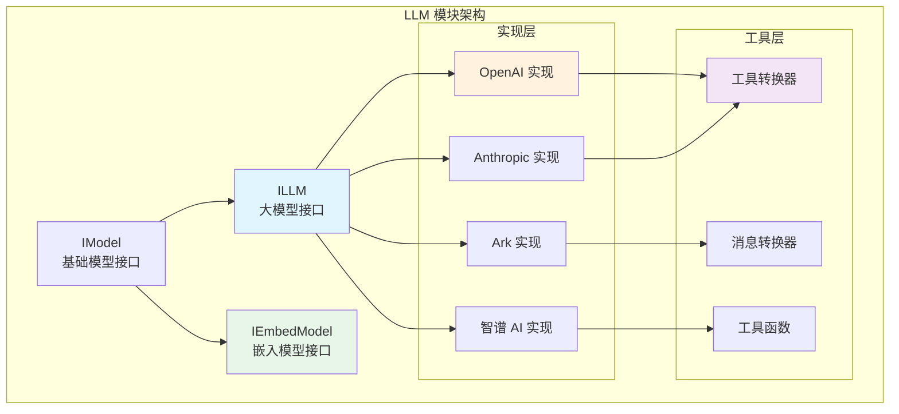

# LLM 大语言模型集成文档

> Tasking LLM 模块提供统一的大语言模型适配接口，支持多种 LLM 提供商，具备工具调用、多模态消息处理和块标签拼接等功能。

## 目录

- [模块概览](#模块概览)
- [核心接口](#核心接口)
- [LLM 适配器开发](#llm-适配器开发)
- [多消息块处理](#多消息块处理)
- [工具转换机制](#工具转换机制)
- [OpenAI 适配器示例](#openai-适配器示例)
- [开发最佳实践](#开发最佳实践)

---

## 模块概览

LLM 模块为 Tasking 框架提供统一的大语言模型抽象层，支持多种主流 LLM 提供商的接入。



### 支持的提供商

- **OpenAI** - GPT 系列模型
- **Anthropic** - Claude 系列模型
- **火山引擎 Ark** - 企业级大模型服务
- **智谱 AI** - GLM 系列模型

### 核心特性

- **统一接口**: 通过 `ILLM` 和 `IEmbedModel` 接口提供一致的 API
- **工具调用**: 支持函数调用和工具执行
- **多模态**: 支持文本、图片、视频等多媒体内容
- **块标签**: 自动处理连续消息块的拼接
- **异步设计**: 全异步实现，支持高并发场景

---

## 核心接口

### ILLM 接口

大语言模型的核心接口，定义了文本补全和配置管理功能。

```python
from abc import abstractmethod, ABC
from typing import Any
from tasking.llm.interface import ILLM
from tasking.model import Message, CompletionConfig
from tasking.model.setting import LLMConfig

class ILLM(IModel):
    """大语言模型协议"""

    @abstractmethod
    async def completion(
        self,
        messages: list[Message],
        completion_config: CompletionConfig,
        **kwargs: Any,
    ) -> Message:
        """执行文本补全

        Args:
            messages: 消息历史列表
            completion_config: 补全配置参数
            **kwargs: 额外参数

        Returns:
            Message: 模型生成的回复消息
        """
        pass

    @classmethod
    @abstractmethod
    def from_config(cls, config: LLMConfig) -> "ILLM":
        """从配置创建实例

        Args:
            config: LLM 配置对象

        Returns:
            ILLM: 大模型实例
        """
        pass
```

### IEmbedModel 接口

嵌入模型接口，用于文本向量化。

```python
class IEmbedModel(IModel):
    """嵌入模型协议"""

    @abstractmethod
    async def embed(
        self,
        content: list[MultimodalContent],
        dimensions: int,
        **kwargs: Any
    ) -> list[float | int]:
        """单个文本嵌入

        Args:
            content: 多模态内容
            dimensions: 嵌入维度
            **kwargs: 额外参数

        Returns:
            list[float | int]: 嵌入向量
        """
        pass

    @abstractmethod
    async def embed_batch(
        self,
        contents: list[list[MultimodalContent]],
        dimensions: int,
        **kwargs: Any
    ) -> list[list[float | int]]:
        """批量文本嵌入

        Args:
            contents: 多模态内容列表
            dimensions: 嵌入维度
            **kwargs: 额外参数

        Returns:
            list[list[float | int]]: 嵌入向量列表
        """
        pass
```

---

## LLM 适配器开发

开发新的 LLM 适配器需要实现 `ILLM` 接口，并处理消息转换、工具调用等核心功能。

### 基础结构

```python
from typing import Any, cast
from pydantic import SecretStr
from tasking.llm.interface import ILLM
from tasking.llm.const import Provider
from tasking.model import (
    Message, Role, StopReason, CompletionConfig,
    CompletionUsage, ToolCallRequest
)

class CustomLLM(ILLM):
    """自定义 LLM 适配器示例"""

    def __init__(self, config: LLMConfig, **kwargs: Any) -> None:
        # 初始化提供商信息
        self._provider = Provider.CUSTOM  # 需在 const.py 中定义
        self._model = config.model
        self._base_url = config.base_url
        self._api_key = config.api_key

        # 初始化客户端
        self.client = CustomClient(
            api_key=self._api_key.get_secret_value(),
            base_url=self._base_url
        )

    @classmethod
    def from_config(cls, config: LLMConfig) -> "ILLM":
        return cls(config)

    def get_provider(self) -> Provider:
        return self._provider

    def get_base_url(self) -> str:
        return self._base_url

    def get_model(self) -> str:
        return self._model

    async def completion(
        self,
        messages: list[Message],
        completion_config: CompletionConfig,
        **kwargs: Any,
    ) -> Message:
        # 1. 转换消息格式
        formatted_messages = self._convert_messages(messages)

        # 2. 转换配置参数
        api_params = self._convert_config(completion_config)

        # 3. 调用 API
        response = await self.client.chat.completions.create(
            model=self._model,
            messages=formatted_messages,
            **api_params
        )

        # 4. 解析响应
        return self._parse_response(response)

    def _convert_messages(self, messages: list[Message]) -> list[dict]:
        """将内部消息格式转换为提供商特定格式"""
        converted = []
        for message in messages:
            # 处理多消息块拼接
            msg_dict = self._convert_single_message(message)
            converted.append(msg_dict)
        return converted

    def _convert_config(self, config: CompletionConfig) -> dict:
        """转换配置参数"""
        return {
            "temperature": config.temperature,
            "max_tokens": config.max_tokens,
            "top_p": config.top_p,
            # 其他参数转换...
        }

    def _parse_response(self, response) -> Message:
        """解析 API 响应为内部消息格式"""
        # 提取内容
        content = response.choices[0].message.content

        # 提取工具调用
        tool_calls = []
        if response.choices[0].message.tool_calls:
            for tc in response.choices[0].message.tool_calls:
                tool_calls.append(ToolCallRequest(
                    id=tc.id,
                    name=tc.function.name,
                    type="function",
                    args=json.loads(tc.function.arguments)
                ))

        # 确定停止原因
        stop_reason = self._determine_stop_reason(response)

        # 计算使用量
        usage = CompletionUsage(
            prompt_tokens=response.usage.prompt_tokens,
            completion_tokens=response.usage.completion_tokens,
            total_tokens=response.usage.total_tokens
        )

        return Message(
            role=Role.ASSISTANT,
            content=[TextBlock(text=content)] if content else [],
            tool_calls=tool_calls,
            stop_reason=stop_reason,
            usage=usage
        )
```

### 必需实现的功能

1. **消息转换**: 处理多消息块和 `<block>` 标签
2. **工具转换**: 将 FastMCP 工具转换为提供商格式
3. **配置映射**: 转换 CompletionConfig 参数
4. **响应解析**: 解析 API 响应为内部格式
5. **错误处理**: 处理网络错误、API 限制等

---

## 多消息块处理

Tasking 系统中，对话上下文可能包含多个来自同一角色的连续消息块。为了正确处理这种情况，适配器需要使用块标签进行拼接。

### 块标签机制

**问题**: 同一角色发送多个连续消息时，需要保持上下文的连续性。

**解决方案**: 使用 `<block>` 标签包装每个消息块。

```python
def _convert_single_message_with_blocks(self, message: Message) -> dict:
    """转换单个消息，处理多块内容"""
  
    message_dict = {
        'role': message.role.value,
        'content': []
    }

    # 提取文本内容用于块包装
    text_content = self._extract_text(message.content)

    # 处理不同的内容类型
    if len(message.content) == 1 and isinstance(message.content[0], TextBlock):
        # 纯文本消息
        message_dict['content'] = [
            {'type': 'text', 'text': f"<block>{text_content}</block>"}
        ]
    else:
        # 多模态消息，用块标签包装
        message_dict['content'] = [
            {'type': 'text', 'text': f"<block>"},
            *self._convert_multimodal_content(message.content),
            {'type': 'text', 'text': f"</block>"}
        ]

    return message_dict

def _convert_multimodal_content(self, content: list) -> list[dict]:
    """转换多模态内容为提供商格式"""
    converted = []
    for block in content:
        if isinstance(block, TextBlock):
            converted.append({'type': 'text', 'text': block.text})
        elif isinstance(block, ImageBlock):
            if block.image_url:
                converted.append({
                    'type': 'image_url',
                    'image_url': {'url': block.image_url}
                })
            elif block.image_base64:
                converted.append({
                    'type': 'image_url',
                    'image_url': {
                        'url': f"data:image/jpeg;base64,{block.image_base64}"
                    }
                })
        # 其他媒体类型处理...
    return converted
```

### 连续消息处理

```python
def _convert_messages(self, messages: list[Message]) -> list[dict]:
    """处理消息序列，包括连续消息的拼接"""
    history = []

    for i, message in enumerate(messages):
        msg_dict = self._convert_single_message_with_blocks(message)

        # 处理连续同角色消息（除特定角色外）
        if i > 0:
            prev_role = history[-1]['role']
            current_role = message.role.value

            # 检查是否需要拼接
            if (prev_role == current_role and
                current_role not in {Role.TOOL.value, Role.ASSISTANT.value}):
                # 可以选择拼接内容或保持分离
                # 这里选择保持分离，让模型理解消息结构
                pass

        # 处理特殊角色逻辑
        if message.role == Role.SYSTEM and i > 0:
            # 系统消息在中间位置时转为用户消息
            msg_dict['role'] = Role.USER.value
        elif message.role == Role.ASSISTANT:
            # 助手消息必须跟随用户消息
            if i > 0 and history[-1]['role'] != Role.USER.value:
                raise ValueError("Assistant message must follow user message")

            # 处理工具调用
            if message.tool_calls:
                msg_dict["tool_calls"] = [
                    {
                        "id": tc.id,
                        "type": "function",
                        "function": {
                            "name": tc.name,
                            "arguments": json.dumps(tc.args, ensure_ascii=False)
                        }
                    }
                    for tc in message.tool_calls
                ]

        history.append(msg_dict)

    return history
```

---

## 工具转换机制

Tasking 默认使用 FastMCP 工具格式，适配器需要将其转换为各提供商的特定格式。

### FastMCP 工具格式

```python
from fastmcp.tools import Tool as FastMcpTool

# FastMCP 工具示例
tool = FastMcpTool(
    name="search_web",
    description="搜索网络信息",
    parameters={
        "type": "object",
        "properties": {
            "query": {
                "type": "string",
                "description": "搜索查询"
            }
        },
        "required": ["query"]
    },
    annotations={
        "title": "网络搜索工具",
        "readOnly": False
    }
)
```

### OpenAI 格式转换器

```python
def tool_schema(tool: McpTool | FastMcpTool) -> dict[str, Any]:
    """将 FastMCP 工具转换为 OpenAI 函数调用格式"""
    schema = {
        "type": "function",
        "function": {
            "name": tool.name,
            "description": tool.description,
            "strict": True,
        }
    }

    if isinstance(tool, FastMcpTool):
        schema['function']['parameters'] = tool.parameters
        schema['function']['annotations'] = tool.annotations
    elif isinstance(tool, McpTool):
        schema['function']['parameters'] = tool.inputSchema
        schema['function']['annotations'] = tool.annotations
    else:
        raise ValueError(f"Unsupported tool type: {type(tool)}")

    return schema

def convert_tools_to_openai(
    tools: list[FastMcpTool],
    exclude_tools: set[str] | None = None
) -> list[dict[str, Any]]:
    """批量转换工具列表"""
    exclude_tools = exclude_tools or set()
    return [
        tool_schema(tool)
        for tool in tools
        if tool.name not in exclude_tools
    ]
```

### 通用转换框架

```python
class ToolConverter:
    """工具转换器基类"""

    @staticmethod
    def convert_tool(tool: FastMcpTool | McpTool) -> dict[str, Any]:
        """转换单个工具"""
        raise NotImplementedError

    @staticmethod
    def convert_tools(
        tools: list[FastMcpTool | McpTool],
        exclude_tools: set[str] | None = None
    ) -> list[dict[str, Any]]:
        """批量转换工具"""
        exclude_tools = exclude_tools or set()
        return [
            ToolConverter.convert_tool(tool)
            for tool in tools
            if tool.name not in exclude_tools
        ]

class OpenAIToolConverter(ToolConverter):
    """OpenAI 工具转换器"""

    @staticmethod
    def convert_tool(tool: FastMcpTool | McpTool) -> dict[str, Any]:
        return tool_schema(tool)

class AnthropicToolConverter(ToolConverter):
    """Anthropic 工具转换器"""

    @staticmethod
    def convert_tool(tool: FastMcpTool | McpTool) -> dict[str, Any]:
        # Anthropic 格式略有不同
        return {
            "name": tool.name,
            "description": tool.description,
            "input_schema": tool.parameters if isinstance(tool, FastMcpTool)
                           else tool.inputSchema
        }
```

### 工具调用结果处理

```python
def parse_tool_call_response(
    response,
    provider: Provider
) -> list[ToolCallRequest]:
    """解析工具调用响应"""
    tool_calls = []

    if provider == Provider.OPENAI:
        if response.choices[0].message.tool_calls:
            for tc in response.choices[0].message.tool_calls:
                tool_calls.append(ToolCallRequest(
                    id=tc.id,
                    name=tc.function.name,
                    type="function",
                    args=json.loads(tc.function.arguments)
                ))

    elif provider == Provider.ANTHROPIC:
        # Anthropic 格式处理
        if response.content:
            for block in response.content:
                if block.type == "tool_use":
                    tool_calls.append(ToolCallRequest(
                        id=block.id,
                        name=block.name,
                        type="function",
                        args=block.input
                    ))

    # 其他提供商...

    return tool_calls
```

---

## OpenAI 适配器示例

以下是一个完整的 OpenAI 适配器实现，展示了所有核心功能的集成。

### 完整实现

```python
import getpass
import json
from typing import Any, cast
from pydantic import SecretStr
from openai import AsyncOpenAI
from openai.types.chat import ChatCompletion, ChatCompletionMessageParam

from tasking.llm.interface import ILLM
from tasking.llm.const import Provider
from tasking.model import (
    Message, Role, StopReason, CompletionConfig,
    CompletionUsage, ToolCallRequest, TextBlock, ImageBlock
)
from tasking.model.setting import LLMConfig
from mcp import Tool as McpTool
from fastmcp.tools import Tool as FastMcpTool

class OpenAiLLM(ILLM):
    """OpenAI 大语言模型适配器"""

    def __init__(self, config: LLMConfig, **kwargs: Any) -> None:
        self._provider = Provider.OPENAI
        self._model = config.model
        self._base_url = config.base_url
        self._api_key = config.api_key

        # API key 安全获取
        if self._api_key.get_secret_value() == "":
            self._api_key = SecretStr(
                getpass.getpass(f"Enter your API key for {self._provider}: ")
            )

        # 初始化客户端
        self.client = AsyncOpenAI(
            base_url=self._base_url,
            api_key=self._api_key.get_secret_value(),
        )

    @classmethod
    def from_config(cls, config: LLMConfig) -> "ILLM":
        return cls(config)

    def get_provider(self) -> Provider:
        return self._provider

    def get_base_url(self) -> str:
        return self._base_url

    def get_model(self) -> str:
        return self._model

    async def completion(
        self,
        messages: list[Message],
        completion_config: CompletionConfig,
        **kwargs: Any,
    ) -> Message:
        """执行 OpenAI ChatCompletion"""

        # 1. 转换配置
        api_params = self._to_openai_params(completion_config)

        # 2. 转换消息
        openai_messages = self._convert_messages(messages)

        # 3. 调用 API
        response: ChatCompletion = await self.client.chat.completions.create(
            model=self._model,
            messages=openai_messages,
            **api_params,
        )

        # 4. 解析响应
        return self._parse_response(response)

    def _to_openai_params(self, config: CompletionConfig) -> dict[str, Any]:
        """转换配置为 OpenAI 参数"""
        params = {
            "temperature": config.temperature,
            "max_tokens": config.max_tokens,
            "top_p": config.top_p,
            "frequency_penalty": config.frequency_penalty,
        }

        # JSON 模式
        if config.format_json:
            params["response_format"] = {"type": "json_object"}
            return params

        # 思考模式控制
        params["extra_body"] = {"enable_thinking": config.allow_thinking}

        # 工具转换
        tools = [
            self._tool_schema(tool)
            for tool in config.tools
            if tool.name not in config.exclude_tools
        ]

        if tools:
            params["tools"] = tools

            # 工具选择
            if config.tool_choice:
                selected_tools = [
                    tool for tool in config.tools
                    if tool.name == config.tool_choice
                ]
                if selected_tools:
                    params["tool_choice"] = self._tool_schema(selected_tools[0])

        return params

    def _tool_schema(self, tool: McpTool | FastMcpTool) -> dict[str, Any]:
        """转换工具为 OpenAI 格式"""
        schema = {
            "type": "function",
            "function": {
                "name": tool.name,
                "description": tool.description,
                "strict": True,
            }
        }

        if isinstance(tool, FastMcpTool):
            schema["function"]["parameters"] = tool.parameters
            schema["function"]["annotations"] = tool.annotations
        else:  # McpTool
            schema["function"]["parameters"] = tool.inputSchema
            schema["function"]["annotations"] = tool.annotations

        return schema

    def _convert_messages(self, messages: list[Message]) -> list[ChatCompletionMessageParam]:
        """转换消息格式，处理块标签"""
        history = []

        for i, message in enumerate(messages):
            msg_dict = self._convert_single_message(message)

            # 特殊角色处理
            if message.role == Role.SYSTEM and i > 0:
                msg_dict['role'] = Role.USER.value
            elif message.role == Role.ASSISTANT:
                if i > 0 and history[-1]['role'] != Role.USER.value:
                    raise ValueError("Assistant message must follow user message")

                # 工具调用处理
                if message.tool_calls:
                    msg_dict["tool_calls"] = [
                        {
                            "id": tc.id,
                            "type": "function",
                            "function": {
                                "name": tc.name,
                                "arguments": json.dumps(tc.args, ensure_ascii=False)
                            }
                        }
                        for tc in message.tool_calls
                    ]
            elif message.role == Role.TOOL:
                msg_dict['tool_call_id'] = message.tool_call_id
                # 工具结果只提取文本
                msg_dict['content'] = self._extract_text(message.content)

            history.append(cast(ChatCompletionMessageParam, msg_dict))

        return history

    def _convert_single_message(self, message: Message) -> dict[str, Any]:
        """转换单个消息，处理块标签"""
    
        msg_dict = {'role': message.role.value}
        text_content = self._extract_text(message.content)

        # 块标签处理
        if len(message.content) == 1 and isinstance(message.content[0], TextBlock):
            # 纯文本
            msg_dict['content'] = [
                {'type': 'text', 'text': f"<block>{text_content}</block>"}
            ]
        else:
            # 多模态
            msg_dict['content'] = [
                {'type': 'text', 'text': f"<block>"},
                *self._convert_multimodal_content(message.content),
                {'type': 'text', 'text': f"</block>"}
            ]

        return msg_dict

    def _convert_multimodal_content(self, content: list) -> list[dict[str, Any]]:
        """转换多模态内容"""
        converted = []
        for block in content:
            if isinstance(block, TextBlock):
                converted.append({'type': 'text', 'text': block.text})
            elif isinstance(block, ImageBlock):
                if block.image_url:
                    converted.append({
                        'type': 'image_url',
                        'image_url': {'url': block.image_url}
                    })
                elif block.image_base64:
                    converted.append({
                        'type': 'image_url',
                        'image_url': {
                            'url': f"data:image/jpeg;base64,{block.image_base64}"
                        }
                    })
        return converted

    def _extract_text(self, content: list) -> str:
        """提取文本内容"""
        return "".join(
            block.text for block in content
            if isinstance(block, TextBlock)
        )

    def _parse_response(self, response: ChatCompletion) -> Message:
        """解析 OpenAI 响应"""
        choice = response.choices[0]

        # 内容提取
        content_text = choice.message.content or ""
        content_blocks = [TextBlock(text=content_text)] if content_text else []

        # 工具调用提取
        tool_calls = []
        if choice.message.tool_calls:
            for tc in choice.message.tool_calls:
                tool_calls.append(ToolCallRequest(
                    id=tc.id,
                    name=tc.function.name,
                    type="function",
                    args=json.loads(tc.function.arguments)
                ))

        # 停止原因判断
        if choice.finish_reason == "length":
            stop_reason = StopReason.LENGTH
        elif choice.finish_reason == "content_filter":
            stop_reason = StopReason.CONTENT_FILTER
        elif choice.finish_reason != "stop" or tool_calls:
            stop_reason = StopReason.TOOL_CALL
        else:
            stop_reason = StopReason.STOP

        # 使用量统计
        usage = CompletionUsage(
            prompt_tokens=response.usage.prompt_tokens if response.usage else -100,
            completion_tokens=response.usage.completion_tokens if response.usage else -100,
            total_tokens=response.usage.total_tokens if response.usage else -100
        )

        return Message(
            role=Role.ASSISTANT,
            content=cast(list[TextBlock | ImageBlock], content_blocks),
            tool_calls=tool_calls,
            stop_reason=stop_reason,
            usage=usage
        )
```

---

## 开发最佳实践

### 1. 错误处理

```python
async def completion(self, messages: list[Message], config: CompletionConfig, **kwargs) -> Message:
    try:
        # API 调用逻辑
        response = await self.client.chat.completions.create(...)
        return self._parse_response(response)

    except RateLimitError:
        # 速率限制处理
        await asyncio.sleep(1)
        return await self.completion(messages, config, **kwargs)

    except AuthenticationError:
        # 认证错误
        raise ValueError("Invalid API key")

    except Exception as e:
        # 通用错误处理
        logger.error(f"LLM completion failed: {e}")
        raise
```

### 2. 配置验证

```python
def __init__(self, config: LLMConfig, **kwargs: Any) -> None:
    # 验证必需配置
    if not config.model:
        raise ValueError("Model name is required")

    if not config.base_url:
        raise ValueError("Base URL is required")

    # 验证模型支持
    supported_models = ["gpt-4", "gpt-3.5-turbo", "gpt-4-turbo"]
    if config.model not in supported_models:
        logger.warning(f"Model {config.model} may not be supported")
```

### 3. 性能优化

```python
class OpenAiLLM(ILLM):
    def __init__(self, config: LLMConfig, **kwargs: Any) -> None:
        # 连接池配置
        self.client = AsyncOpenAI(
            http_client=httpx.AsyncClient(
                limits=httpx.Limits(max_keepalive_connections=5, max_connections=10)
            )
        )

    async def completion(self, messages: list[Message], config: CompletionConfig, **kwargs) -> Message:
        # 请求去重
        cache_key = self._generate_cache_key(messages, config)
        if cached := self._cache.get(cache_key):
            return cached

        # 调用 API
        response = await self.client.chat.completions.create(...)
        result = self._parse_response(response)

        # 缓存结果
        self._cache.set(cache_key, result, ttl=300)
        return result
```

### 4. 类型安全

```python
from typing import TypeVar, Generic, Union

StateT = TypeVar('StateT')
EventT = TypeVar('EventT')

class GenericLLM(ILLM, Generic[StateT, EventT]):
    """支持泛型的 LLM 适配器"""

    async def completion(
        self,
        messages: list[Message],
        completion_config: CompletionConfig,
        **kwargs: Any,
    ) -> Message:
        # 类型注解确保返回值正确
        result: Message = await self._do_completion(messages, completion_config)
        return result
```

### 5. 测试策略

```python
import pytest
from unittest.mock import AsyncMock, patch

class TestOpenAiLLM:
    @pytest.fixture
    def llm(self):
        config = LLMConfig(
            model="gpt-3.5-turbo",
            base_url="https://api.openai.com/v1",
            api_key=SecretStr("test-key")
        )
        return OpenAiLLM(config)

    @pytest.mark.asyncio
    async def test_completion_success(self, llm):
        # Mock API 响应
        mock_response = AsyncMock()
        mock_response.choices = [MagicMock()]
        mock_response.choices[0].message.content = "Hello!"
        mock_response.choices[0].message.tool_calls = None
        mock_response.usage.prompt_tokens = 10
        mock_response.usage.completion_tokens = 5
        mock_response.usage.total_tokens = 15

        with patch.object(llm.client.chat.completions, 'create',
                         return_value=mock_response):
            result = await llm.completion([], CompletionConfig())

            assert result.role == Role.ASSISTANT
            assert result.content[0].text == "Hello!"
```

### 6. 文档和日志

```python
import logging

logger = logging.getLogger(__name__)

class OpenAiLLM(ILLM):
    """OpenAI 大语言模型适配器

    支持:
    - GPT-3.5-turbo, GPT-4, GPT-4-turbo 等模型
    - 函数调用和工具使用
    - 多模态内容（文本+图片）
    - 流式输出

    配置示例:
        config = LLMConfig(
            model="gpt-4",
            base_url="https://api.openai.com/v1",
            api_key=SecretStr("your-api-key")
        )
    """

    async def completion(self, messages: list[Message], config: CompletionConfig, **kwargs) -> Message:
        logger.debug(f"Starting completion with {len(messages)} messages")

        try:
            result = await self._do_completion(messages, config)
            logger.debug(f"Completion successful, tokens: {result.usage.total_tokens}")
            return result

        except Exception as e:
            logger.error(f"Completion failed: {e}")
            raise
```

---

## 总结

开发 LLM 适配器时需要重点关注：

1. **接口实现**: 严格遵循 `ILLM` 和 `IEmbedModel` 接口规范
2. **消息处理**: 正确处理块标签和多模态内容转换
3. **工具转换**: 实现 FastMCP 到提供商格式的转换
4. **错误处理**: 健壮的异常处理和重试机制
5. **类型安全**: 使用完整的类型注解和静态检查
6. **性能优化**: 连接池、缓存、异步处理等
7. **测试覆盖**: 单元测试和集成测试

通过遵循这些指南，可以开发出高质量、可维护的 LLM 适配器，无缝集成到 Tasking 框架中。

**最后更新**: 2025-12-07
